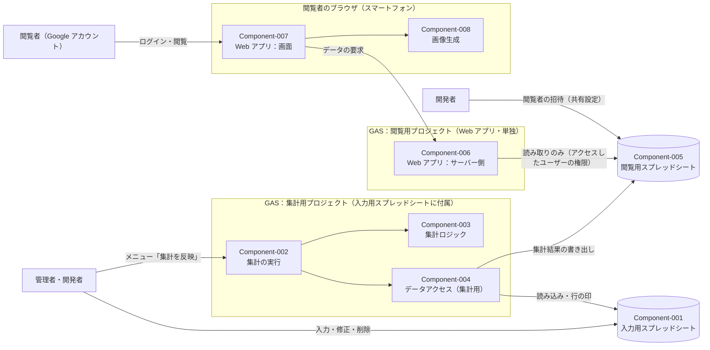
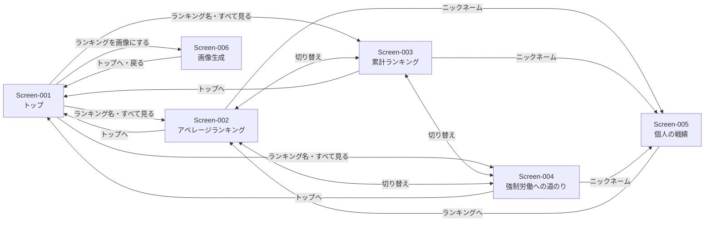

# コンポーネント設計書

| 項目 | 内容 |
|---|---|
| 工程 | b1 コンポーネント設計 |
| plan ファイル | `plans/b1_design.md` |
| 入力 | `docs/a1_requirements/requirements.md` |
| 最終更新 | 2026-09-26 20:07 |

## 1. 概要

### 背景

テキサスホールデムポーカーの勝ち負けを記録し、ランキングとして入力・可視化することで、ゲームを盛り上げる。参加回数の少ない人でも活躍が見えるよう、3 種類のランキングを用意する。各プレイヤーが楽しめ、嫌な気持ちにならないものとする。（由来：requirements.md 1. 概要）

### 対象範囲

- プレイ結果・設定値の入力、修正・削除（Google スプレッドシートへの直接入力）（由来：Feature-001、Feature-002、Feature-011）
- 収支と 3 種類のランキング（アベレージランキング、累計ランキング、強制労働への道のり）の集計（由来：Feature-003〜Feature-007）
- 閲覧用の Web アプリ（トップ画面、ランキング画面 3 種、個人の戦績画面、画像生成画面、免責表示）（由来：Feature-008〜Feature-010、Feature-012、Feature-013）
- 招待したメンバーのみが閲覧できるアクセス制御（由来：Quality-001〜Quality-003）

## 2. 目標と非目標

### 目標

| 目標 | 由来 |
|---|---|
| 管理者がスプレッドシートにプレイ結果を入力し、メニューの操作 1 回で集計結果を画面に反映できる | Feature-001、Feature-011、Decision-0002 |
| 3 種類のランキングと個人の戦績を、要件の計算式・順位の付け方どおりに表示する | Feature-003〜Feature-007、Feature-009、Feature-010 |
| 招待したアカウントのみが画面のデータを閲覧でき、入力用スプレッドシートは管理者・開発者のみが扱える | Quality-001〜Quality-003、Decision-0001、Decision-0007 |
| スマートフォンで、採用した画面モックどおりに表示・操作できる | Quality-004、Quality-005、Feature-008〜Feature-010、Feature-012 |
| 無料の範囲（Google スプレッドシート・GAS）で動作する | Constraint-001、Constraint-002 |
| 集計ロジックをスプレッドシート等から分離し、ローカルで Small テストを実行できる | 確認観点 8（テストのしやすさ）、CLAUDE.md 4.（テストの分担） |

### 非目標

| 非目標 | 根拠 | 由来 |
|---|---|---|
| 専用の結果入力画面を作ること | スプレッドシートへ直接入力する | requirements.md 3. 対象範囲（対象外）、a1/Question-008 |
| プレイヤーの登録画面、通知、コメント、ゲームの進行補助 | ランキング集計に必要のないことは対象外 | requirements.md 3. 対象範囲（対象外）、Request-7-1 |
| データのバックアップ、独自の入力・修正履歴 | 版の履歴で代替し、バックアップは不要 | requirements.md 3. 対象範囲（対象外）、Quality-007 |
| 入力から画面への自動・即時の反映 | 管理者のメニュー操作で反映する | Decision-0002 |
| 設定値の変更前後で過去の実施日の計算を分けること | 設定値は 1 つで、変更すると過去も再計算する | Decision-0006 |
| エラーの通知・独自のエラー記録 | GAS の標準の実行ログのみとする | b1/Question-009 |

## 3. 全体構成

| 項目 | 内容 | 由来 |
|---|---|---|
| 実行環境 | 入力・集計：Google スプレッドシートと GAS（集計用プロジェクト）。閲覧：GAS の Web アプリ（閲覧用プロジェクト）をスマートフォンのブラウザで開く | Constraint-001、Quality-005、Decision-0007 |
| 配置先 | Google ドライブ（入力用・閲覧用スプレッドシート）、GAS（集計用・閲覧用の 2 プロジェクト） | Constraint-001、Constraint-002、Decision-0001、Decision-0007 |
| Web アプリの公開設定 | 実行するユーザー：アクセスしたユーザー ／ アクセスできるユーザー：Google アカウントを持つ全員 | Decision-0001 |
| プログラミング言語 | JavaScript | Decision-0005 |
| 画面の実装 | HTML・CSS・JavaScript のみ（外部ライブラリ・外部通信なし） | Decision-0003 |

## 4. コンポーネント

### Component-001：入力用スプレッドシート

- 責務：プレイ結果と設定値を保持し、管理者・開発者が入力・修正・削除する場所を提供する。
- インターフェース：
  - シート「プレイ結果」：1 人 1 実施日 1 行。列はプレイヤー名、プレイ日付（yyyy/mm/dd）、プレイ時間（時間。小数可）、最終チップ数、借金回数（Feature-001）
  - シート「設定」：配布チップ数、強制労働の基準の回数 N（初期値として 10 を入れておく）（Feature-002、b1/Question-019）
  - 入力規則：プレイ日付は日付、プレイ時間・最終チップ数・借金回数は数値に制限する（b1/Question-007 (a)）
  - プレイヤー名の列に既存のニックネームを候補として表示し、候補にない新しい名前も入力できる（b1/Question-007 (b)、Feature-001 条件4）
  - 集計の実行時に、集計から除外した行に印（背景色）が付く（b1/Question-008）
- 依存関係：なし（Component-002 から読み書きされる）
- 対応する要件：Feature-001、Feature-002、Feature-011、Quality-002、Quality-007、Quality-008
- 関連する設計判断：Decision-0001、Decision-0006

### Component-002：集計の実行

- 責務：入力用スプレッドシートのメニュー「集計を反映」を提供し、設定値と行の確認、集計、閲覧用スプレッドシートへの書き出し、管理者への結果の通知を行う。
- インターフェース：
  - メニュー「集計を反映」（入力用スプレッドシートを開いたときに追加する）（Decision-0002）
  - 処理の流れ：
    1. 設定値（配布チップ数・N）を確認する。どちらかが空欄・誤った形式なら集計を中止し、管理者にメッセージで知らせる。閲覧用スプレッドシートは更新しない（b1/Question-019）
    2. プレイ結果の各行を確認し、必須の項目が空欄の行・形式が誤っている行を集計から除外し、該当する行に印を付ける。前回の印は消してから付け直す（b1/Question-008）
    3. 集計ロジック（Component-003）で全年分を集計し、閲覧用スプレッドシートの内容を置き換える（Decision-0006）
    4. 集計の完了と、除外した行の数を管理者にメッセージで知らせる（b1/Question-008）
- 依存関係：Component-003、Component-004
- 対応する要件：Feature-001、Feature-002、Feature-011、Quality-002
- 関連する設計判断：Decision-0002、Decision-0006、Decision-0007

### Component-003：集計ロジック

- 責務：スプレッドシート等の実行環境に依存しない純粋な計算として、行の確認と、収支・ランキング・個人の戦績の集計を行う。入力は配列と設定値、出力は集計結果のデータとする。
- インターフェース（計算の内容）：
  - 行の確認：必須の 5 項目がすべてあり、プレイ日付が日付、プレイ時間・最終チップ数・借金回数が数値であるか（b1/Question-007 (a)、b1/Question-008）
  - ニックネームの前後の空白を取り除く（b1/Question-007 (c)）
  - 収支 ＝ 最終チップ数 − 配布チップ数 × 借金回数（Feature-003）
  - ウェイト ＝ √（プレイ時間 ÷ 2）、上限 100%（Feature-004 条件2）
  - アベレージランキングの値（平均値チップ数）＝ 実施日ごとの（収支 × ウェイト）を集計期間内の参加日で単純平均した値。値の大きい順（Feature-004、b1/Question-016）
  - 累計ランキングの値（累計チップ数）＝ 集計期間内の収支の合計。値の大きい順（Feature-005）
  - 強制労働への道のり：基準値（集計期間内の収支の合計）がマイナスのプレイヤーのみ、値の小さい順。基準値 ≦ −（配布チップ数 × N）で「強制労働」（Feature-006）
  - 集計期間：暦年（1 月 1 日〜12 月 31 日）。年ごとに集計し、基準値は年ごとに数え直す（Feature-006 条件4、Feature-007）
  - 順位：同じ値は同じ順位とし、次の順位は同順の人数分を飛ばす（例：1 位、1 位、3 位）（Feature-007 条件3）
  - 個人の戦績：参加日数、合計プレイ時間、収支の累計、平均値チップ数、借金回数の累計、強制労働までの残りチップ数（基準値 −（−配布チップ数 × N））、各ランキングでの順位（強制労働への道のりの対象外は順位なし）、実施日ごとの履歴（Feature-010）
- 依存関係：なし
- 対応する要件：Feature-003〜Feature-007、Feature-010
- 関連する設計判断：Decision-0006

### Component-004：データアクセス（集計用）

- 責務：入力用スプレッドシートの読み込みと行への印付け、閲覧用スプレッドシートへの集計結果の書き出しを行う。集計ロジックから分離し、GAS の `SpreadsheetApp` を使う処理をここに集める。
- インターフェース：プレイ結果の読み込み、設定値の読み込み、除外した行への印付け（前回の印の消去を含む）、集計結果の書き出し（閲覧用スプレッドシートの内容の置き換え）
- 依存関係：Component-001、Component-005、GAS の `SpreadsheetApp`
- 対応する要件：Feature-001、Feature-002、Quality-002
- 関連する設計判断：Decision-0001、Decision-0007

### Component-005：閲覧用スプレッドシート

- 責務：画面に表示する集計結果のみを保持する。閲覧者に閲覧権限で共有する（＝招待）。
- インターフェース：シートの構成は「5. データ設計」のとおり。
- 依存関係：なし（Component-004 から書き込まれ、Component-006 から読み込まれる）
- 対応する要件：Quality-001、Quality-003、Quality-006、Quality-008
- 関連する設計判断：Decision-0001

### Component-006：Web アプリ：サーバー側

- 責務：Web アプリの入口として画面（HTML）を返し、画面からの要求に応じて閲覧用スプレッドシートから集計結果を読み込んで返す。アクセスしたユーザーの権限で実行するため、共有されていないアカウントではデータを読めない。
- インターフェース：
  - 画面の表示：Web アプリの URL を開くと、1 つの HTML（Component-007）を返す
  - データの取得：年を指定して、その年のランキング・個人の戦績・履歴と、集計日時・集計済みの年の一覧を返す
  - 閲覧用スプレッドシートを読めない場合は、閲覧できない旨を画面に返す（データは返さない）
  - 利用者に求める権限はスプレッドシートの読み取りのみとする
- 依存関係：Component-005、GAS の `HtmlService`・`SpreadsheetApp`
- 対応する要件：Feature-007〜Feature-010、Feature-012、Quality-001
- 関連する設計判断：Decision-0001、Decision-0007

### Component-007：Web アプリ：画面

- 責務：Screen-001〜Screen-006 を表示する。画面の切り替えと年の切り替えは JavaScript で行い、データは Component-006 から取得する。
- インターフェース：画面ごとの項目は「8. 画面設計」のとおり。
  - 画面に表示する文字列（ニックネーム等）は、すべて文字として表示し、HTML として解釈させない（b1/Question-018）
  - 外部のライブラリ・外部への通信を使わない（Decision-0003）
  - すべての画面に免責表示を置く（Feature-013）
- 依存関係：Component-006、Component-008
- 対応する要件：Feature-006〜Feature-010、Feature-013、Quality-004、Quality-005
- 関連する設計判断：Decision-0003

### Component-008：画像生成

- 責務：ブラウザの描画機能（canvas）で、3 つのランキングの上位 5 名を 1 枚にまとめた 9:16（1080 × 1920 ピクセル）の画像を作り、画面に表示する。利用者は画像を長押しして保存・共有する。
- インターフェース：表示中の年の集計結果を受け取り、画像を作る。「画像を作り直す」で再作成する（Screen-006）。
- 依存関係：Component-007（表示中の集計結果）
- 対応する要件：Feature-012、Quality-005
- 関連する設計判断：Decision-0003、Decision-0004

## 5. データ設計

| データ名 | 保存先 | 形式 | 保存期間 | 機密性への対策 | 由来 |
|---|---|---|---|---|---|
| プレイ結果 | 入力用スプレッドシート（Component-001）シート「プレイ結果」 | 1 人 1 実施日 1 行。プレイヤー名（ニックネーム）、プレイ日付、プレイ時間、最終チップ数、借金回数 | 無期限（バックアップなし。履歴は版の履歴で代替） | 管理者・開発者のみに共有する。閲覧者には共有しない | requirements.md 6.、Quality-002、Quality-007、Decision-0001 |
| 設定値 | 入力用スプレッドシート（Component-001）シート「設定」 | 配布チップ数、強制労働の基準の回数 N（それぞれ 1 つ） | 無期限 | 同上 | requirements.md 6.、Decision-0006 |
| 集計結果 | 閲覧用スプレッドシート（Component-005） | 下表のとおり。集計のたびに全年分を置き換える | 次の集計まで（入力用スプレッドシートから再作成できる） | 閲覧者（招待したアカウント）に閲覧権限で共有する。編集は管理者・開発者のみ。ニックネーム以外の個人を特定できる情報を含まない | Quality-001、Quality-003、Quality-008、Decision-0001、Decision-0006 |

閲覧用スプレッドシートのシート構成（由来：Feature-007〜Feature-010、Feature-012）：

| シート | 内容 | 由来 |
|---|---|---|
| 集計情報 | 集計日時、集計済みの年の一覧 | Feature-007 条件2（年の切り替え）、Screen-006（画像の「時点」の表示） |
| ランキング | 年、ランキングの種類（アベレージ／累計／強制労働への道のり）、順位、ニックネーム、値、参加日数、強制労働の該当 | Feature-004〜Feature-006、Feature-008、Feature-009 |
| 個人の戦績 | 年、ニックネーム、参加日数、合計プレイ時間、収支の累計（基準値）、平均値チップ数、借金回数の累計、強制労働までの残りチップ数、各ランキングでの順位（強制労働への道のりの対象外は空欄） | Feature-010 |
| 履歴 | 年、ニックネーム、実施日、プレイ時間、最終チップ数、借金回数、収支 | Feature-010（実施日ごとの履歴）、Screen-005 |

データ量：プレイヤー約 30 人、月 2 回程度の実施で、年あたり最大約 720 行（30 人 × 24 日）のプレイ結果を無期限に蓄積する（由来：Quality-006）。

## 6. 外部インターフェース

| 連携先 | 連携方式 | 認証 | 扱うデータ | 由来 |
|---|---|---|---|---|
| Google スプレッドシート（入力用・閲覧用） | GAS の `SpreadsheetApp` | 集計用：実行した管理者・開発者のアカウントの権限。閲覧用：アクセスした閲覧者のアカウントの権限（読み取りのみ） | プレイ結果、設定値、集計結果 | Decision-0001、Decision-0007 |
| Google アカウント（ログイン） | GAS の Web アプリの公開設定（Google アカウントを持つ全員） | Google アカウントのログイン | なし（閲覧の可否は閲覧用スプレッドシートの共有で決まる） | Quality-001、Constraint-004、Decision-0001 |
| Google ドライブ（共有設定） | 開発者が手作業で共有設定を変更する | 開発者のアカウント | 閲覧者の追加・削除 | Quality-003、Decision-0001 |

## 7. 横断的な関心事

### セキュリティ（脅威分析：STRIDE）

| 分類 | 対象 | 脅威 | 対策 | 対応する要件 |
|---|---|---|---|---|
| なりすまし（Spoofing） | Component-006 | 招待していない人が Web アプリの URL を開いてデータを閲覧する | Google アカウントでのログインを必須とし、アクセスしたユーザーの権限で閲覧用スプレッドシートを読む。共有されていないアカウントではデータを読めず、閲覧できない旨のみを表示する | Quality-001、Constraint-004、Decision-0001 |
| 改ざん（Tampering） | Component-001、Component-005 | 閲覧者がプレイ結果・集計結果を書き換える | 入力用スプレッドシートは閲覧者に共有しない。閲覧用スプレッドシートは閲覧者に閲覧権限のみで共有する。閲覧用の Web アプリは読み取りの権限のみを持つ | Quality-001、Quality-002、Decision-0001、Decision-0007 |
| 改ざん（Tampering） | Component-007 | ニックネームに HTML・スクリプトの文字列が入力され、閲覧者の画面で意図しない表示・動作が起きる | 画面に表示する文字列はすべて文字として表示し、HTML として解釈させない | b1/Question-018 |
| 否認（Repudiation） | Component-001、Component-002 | 誰がいつプレイ結果・設定値を変更したか、集計したかが分からない | 入力・修正の履歴は Google スプレッドシートの版の履歴で確認する。集計の実行は GAS の標準の実行ログで確認する | Quality-007、b1/Question-009 |
| 情報漏えい（Information Disclosure） | Component-001、Component-005 | プレイ結果の元データや個人を特定できる情報が閲覧者・第三者に見られる | 入力用スプレッドシートは管理者・開発者のみに共有する。閲覧用スプレッドシートには集計結果のみを置き、ニックネーム以外の個人を特定できる情報を扱わない。閲覧者が閲覧用スプレッドシートを直接開けることは、Decision-0001 の選択で受け入れた | Quality-001、Quality-002、Quality-008、Decision-0001 |
| サービス妨害（Denial of Service） | Component-006 | 大量のアクセスで GAS の実行の上限に達し、閲覧できなくなる | Web アプリはログインが必須で、データを読めるのは招待したアカウントのみ。想定の規模（約 30 人）では追加の対策を設けない | Quality-001、Quality-006、Constraint-002 |
| 権限昇格（Elevation of Privilege） | Component-002、Component-006 | 閲覧者が集計の実行や、閲覧者のアカウントでの書き込みを行う | 集計のメニューは入力用スプレッドシート（閲覧者に共有しない）にのみ置く。閲覧用の Web アプリは別のプロジェクトとし、閲覧者に求める権限をスプレッドシートの読み取りのみにする | Quality-001、Quality-002、Decision-0007 |

### 認証・認可

- 認証：Google アカウントでのログイン（Web アプリの公開設定「Google アカウントを持つ全員」）。（由来：Quality-001、Constraint-004、Decision-0001）
- 認可：閲覧用スプレッドシートの共有設定で行う。開発者が閲覧者のアカウントを閲覧権限で追加・削除する。入力用スプレッドシートは管理者・開発者のみに編集権限で共有し、管理者・開発者は閲覧用スプレッドシートの編集権限も持つ（集計結果の書き出しのため）。（由来：Quality-001〜Quality-003、Decision-0001、Decision-0002）
- 閲覧者は初回アクセス時に、閲覧用の Web アプリにスプレッドシートの読み取りの権限を許可する。（由来：Decision-0001、Decision-0007）

### プライバシー

プレイヤー名はニックネームのみとし、入力項目・閲覧用スプレッドシート・画面・画像にニックネーム以外の個人を特定できる情報を含めない。閲覧者のアカウント情報はアプリケーションで保存しない。（由来：requirements.md 6. 主要なデータ、Quality-008）

### ログ・監視

GAS の標準の実行ログのみとし、開発者が必要なときに確認する。独自のエラー記録・通知は行わない。入力・修正の履歴は Google スプレッドシートの版の履歴で代替する。（由来：b1/Question-009、Quality-007）

### エラー処理

| 発生箇所 | 状況 | 扱い | 由来 |
|---|---|---|---|
| Component-002 | 設定値（配布チップ数・N）のどちらかが空欄・誤った形式 | 集計を中止し、管理者にメッセージで知らせる。閲覧用スプレッドシートは更新しない | b1/Question-019 |
| Component-002 | プレイ結果の行で、必須の項目が空欄・形式が誤っている | その行を集計から除外し、行に印（背景色）を付ける。他の行の集計は続ける。完了時に除外した行の数を知らせる | b1/Question-008 |
| Component-002 | 閲覧用スプレッドシートへの書き出しに失敗した | 管理者にメッセージで知らせる。詳細は GAS の標準の実行ログで確認する | b1/Question-009 |
| Component-006、Component-007 | 閲覧用スプレッドシートを読めない（招待されていない等） | データを表示せず、閲覧できない旨を表示する | Quality-001、Decision-0001 |
| Component-007 | 強制労働への道のりの対象者（基準値がマイナスのプレイヤー）がいない | 「ランキングなし」と表示する | Feature-006 条件1-2 |

### テストのしやすさ

| 実行環境固有の機能 | 依存する Component | 分離の方法 | ローカルで確認できない範囲と、確認するテストのサイズ | 由来 |
|---|---|---|---|---|
| GAS の `SpreadsheetApp`（入力用・閲覧用の読み書き） | Component-004、Component-006 | 読み書きを Component-004・Component-006 に集め、集計ロジック（Component-003）は配列と設定値を引数で受け取り、集計結果を返す。Small テストでは Component-003 を直接呼び出し、Component-002 の処理の流れは Component-004 を代用品（モック）に置き換えて確認する | 実際のシートの読み書き、行の印付け → Medium（デプロイ先） | 確認観点 8、Decision-0007 |
| GAS の `SpreadsheetApp.getUi()`（メニュー・メッセージ） | Component-002 | メニュー・メッセージの表示を処理の流れから分け、Small テストでは代用品に置き換える | メニューの表示とメッセージの表示 → Medium（デプロイ先） | 確認観点 8、Decision-0002 |
| GAS の `HtmlService`・`google.script.run`（画面とサーバーのやりとり） | Component-006、Component-007 | 画面の描画に使う表示用の整形（文字列の無害化、数値・順位の表示形式）を関数として分け、Small テストで確認する | Web アプリの表示・画面の切り替え → Large（デプロイ先、スマートフォン） | 確認観点 8、Decision-0003 |
| アクセス制御（Web アプリの公開設定、スプレッドシートの共有） | Component-005、Component-006 | 分離できない | 招待したアカウント・招待していないアカウント・未ログインでの閲覧の可否、閲覧者が許可する権限 → Large（デプロイ先、複数のアカウント） | Quality-001〜Quality-003、Decision-0001、Decision-0007 |
| ブラウザの描画機能（canvas）、端末の保存・共有 | Component-008 | 画像に描く内容（各ランキングの上位 5 名と表示位置）を求める処理を描画から分け、Small テストで確認する | 画像の見た目、長押しでの保存・共有 → Large（実機のスマートフォン） | Feature-012、Decision-0004 |

## 8. 画面設計

### 見た目の基準

- 雰囲気：ポーカー・カジノを題材にしたテーマ（テーブルの緑、金色、チップ・トランプの意匠）（由来：b1/Question-010）
- 文字と背景の明暗の差：WCAG 2.1 AA（通常の文字で 4.5:1 以上）（由来：b1/Question-010-1）
- スマートフォンでの表示を前提とする（由来：Quality-005）
- アプリの名称：POKER RANKING（由来：b1/Question-015-1）
- ランキングの呼び名：アベレージランキング（ランキング 1）、累計ランキング（ランキング 2）、強制労働への道のり（由来：b1/Question-012-1）
- 免責表示の文言：「本ページは有志が作成したものであり、開催店舗とは関係ありません。」（由来：b1/Question-015、Feature-013）

### 画面一覧

| Screen | 名称 | 利用者 | 対応する Feature | 担当する Component | モック | 由来 |
|---|---|---|---|---|---|---|
| Screen-001 | トップ画面 | 閲覧者・管理者・開発者 | Feature-006〜Feature-008、Feature-012、Feature-013 | Component-006、Component-007 | [Screen-001.html](mockups/Screen-001.html) | b1/Question-012（案 a） |
| Screen-002 | ランキング画面：アベレージランキング | 同上 | Feature-004、Feature-007、Feature-009、Feature-013 | Component-006、Component-007 | [Screen-002.html#r1](mockups/Screen-002.html) | b1/Question-013（案 a） |
| Screen-003 | ランキング画面：累計ランキング | 同上 | Feature-005、Feature-007、Feature-009、Feature-013 | Component-006、Component-007 | [Screen-002.html#r2](mockups/Screen-002.html) | b1/Question-013（案 a） |
| Screen-004 | ランキング画面：強制労働への道のり | 同上 | Feature-006、Feature-007、Feature-009、Feature-013 | Component-006、Component-007 | [Screen-002.html#r3](mockups/Screen-002.html) | b1/Question-013（案 a） |
| Screen-005 | 個人の戦績画面 | 同上 | Feature-007、Feature-010、Feature-013 | Component-006、Component-007 | [Screen-005.html](mockups/Screen-005.html) | b1/Question-014 |
| Screen-006 | 画像生成画面 | 同上 | Feature-012、Feature-013 | Component-007、Component-008 | [Screen-006.html](mockups/Screen-006.html) | b1/Question-014 |

- Screen-002〜Screen-004 は表示する値のみが異なる共通の配置のため、モックは 1 ファイル（`Screen-002.html` の #r1〜#r3）で表示する。（由来：b1/Question-013）
- 結果入力は専用画面を作らず、入力用スプレッドシート（Component-001）へ直接入力する。（由来：a1/Question-008）

### 画面遷移

（由来：Feature-008 条件2、Feature-009 条件2、b1/review-003、採用したモックのリンク）

### 画面ごとの項目

#### 共通

| 項目 | 種別 | 内容 | 由来 |
|---|---|---|---|
| 年の選択 | 操作 | 集計済みの年から選ぶ。選んだ年の集計結果を表示する（Screen-001〜Screen-005） | Feature-007 条件2 |
| 集計期間 | 表示 | 選んだ年の 1 月 1 日〜12 月 31 日 | Feature-007 条件1 |
| 免責表示 | 表示 | 「本ページは有志が作成したものであり、開催店舗とは関係ありません。」（画面の下部） | Feature-013、b1/Question-015 |
| 閲覧できない旨 | 表示 | 閲覧用スプレッドシートを読めない場合に、データの代わりに表示する | Quality-001、Decision-0001 |

#### Screen-001：トップ画面

| 項目 | 種別 | 内容 | 由来 |
|---|---|---|---|
| アプリの名称 | 表示 | POKER RANKING | b1/Question-015-1 |
| ランキングのカード（3 枚） | 表示 | アベレージランキング、累計ランキング、強制労働への道のりの順に、ランキング名、説明文、上位 5 名（順位・ニックネーム・値）を表示する | Feature-008 条件1、b1/Question-012、b1/review-001 |
| 「強制労働」のラベル | 表示 | 強制労働への道のりで、該当するプレイヤーのニックネームの右側に表示する | Feature-006 条件2、b1/review-007 |
| ランキング名・「すべて見る」 | 操作 | そのランキング画面（Screen-002〜Screen-004）に移動する | Feature-008 条件2、b1/review-003 |
| 「ランキングを画像にする」 | 操作 | Screen-006 に移動する | Feature-012 |

#### Screen-002〜Screen-004：ランキング画面

| 項目 | 種別 | 内容 | 由来 |
|---|---|---|---|
| ランキングの切り替え | 操作 | アベレージ／累計／強制労働の 3 画面を切り替える | Feature-009、b1/Question-013 |
| 「トップへ」 | 操作 | Screen-001 に移動する | 採用したモック |
| ランキング名・説明文 | 表示 | アベレージ：回数が少なくても活躍できる（プレイ時間で補正した 1 日あたりの収支の平均）／累計：参加したすべてのゲームの累計（集計期間内の収支の合計が大きい順）／強制労働：強制労働に誰が近いか！のランキング（集計期間内の収支の合計がマイナスの人のみ。小さい順）。−（配布チップ数 × N）以下で「強制労働」 | b1/Question-012-1、b1/review-001、Feature-004〜Feature-006 |
| 一覧 | 表示 | 順位、ニックネーム、値（見出し：アベレージ＝平均値チップ数、累計＝累計チップ数、強制労働＝基準値）、参加日数。対象者全員を順位の順に表示する | Feature-009 条件1、b1/Question-016、b1/review-006 |
| 「強制労働」のラベル | 表示 | Screen-004 で、該当するプレイヤーのニックネームの右側に表示する | Feature-006 条件2、b1/review-007 |
| 「ランキングなし」 | 表示 | Screen-004 で、対象者がいない場合に表示する | Feature-006 条件1-2、b1/review-004 |
| ニックネーム | 操作 | そのプレイヤーの Screen-005 に移動する | Feature-009 条件2 |

#### Screen-005：個人の戦績画面

| 項目 | 種別 | 内容 | 由来 |
|---|---|---|---|
| 「ランキングへ」 | 操作 | ランキング画面に移動する | 採用したモック |
| ニックネーム | 表示 | 表示中のプレイヤーのニックネーム | Feature-010 |
| 数値のタイル | 表示 | 参加日数、合計プレイ時間、収支の累計、平均値チップ数 | Feature-010 条件1、b1/Question-016 |
| 各ランキングでの順位 | 表示 | アベレージ、累計、強制労働の順位。強制労働への道のりの対象外は「−」 | Feature-010 条件1・条件2-2、b1/review-002 |
| 強制労働までの道のり | 表示 | 借金回数の累計、強制労働までの残りチップ数と基準値、残りの割合のゲージ | Feature-010 条件1 |
| 実施日ごとの履歴 | 表示 | 日付、時間、最終チップ、借金、収支（新しい日付から） | Feature-010 条件1、採用したモック |

#### Screen-006：画像生成画面

| 項目 | 種別 | 内容 | 由来 |
|---|---|---|---|
| 「トップへ」「戻る」 | 操作 | Screen-001 に移動する | 採用したモック |
| 保存の案内 | 表示 | 「画像を長押しすると、端末に保存・共有できます。」 | Feature-012 条件2、Decision-0004 |
| 画像 | 表示 | 9:16（1080 × 1920 ピクセル）。アプリの名称、年と集計時点、3 つのランキングの上位 5 名、免責表示 | Feature-012 条件1・条件3、b1/Question-014 |
| 「画像を作り直す」 | 操作 | 画像を作り直す | 採用したモック |

## 9. 検討した代替案

| 設計判断 | 題名 | 採用した選択肢 | 検討した他の選択肢 |
|---|---|---|---|
| [Decision-0001](decisions/Decision-0001-閲覧のアクセス制御の方式.md) | 閲覧のアクセス制御の方式 | アクセスしたユーザーとして実行＋閲覧用スプレッドシートの共有 | 自分として実行＋URL の共有 |
| [Decision-0002](decisions/Decision-0002-集計のタイミング.md) | 集計のタイミング | 管理者がメニューから実行 | 定期的な自動の書き出し、両方、閲覧のたびに集計 |
| [Decision-0003](decisions/Decision-0003-画面の実装方式.md) | 画面の実装方式 | HTML・CSS・JavaScript のみ | 軽量なライブラリを CDN から読み込む |
| [Decision-0004](decisions/Decision-0004-画像生成の方式.md) | 画像生成の方式 | ブラウザの canvas | Google スライドから画像を書き出す |
| [Decision-0005](decisions/Decision-0005-プログラミング言語.md) | プログラミング言語 | JavaScript | TypeScript |
| [Decision-0006](decisions/Decision-0006-設定値の持ち方.md) | 設定値の持ち方 | 設定値は 1 つ（変更すると過去も再計算） | 配布チップ数を実施日ごとに記録 |
| [Decision-0007](decisions/Decision-0007-GASのプロジェクトの構成.md) | GAS のプロジェクトの構成 | 集計用と閲覧用の 2 プロジェクト | 1 つのプロジェクト |

## 10. トレーサビリティ

| 要件 | 対応する Component・Screen・設計事項 | 備考 |
|---|---|---|
| Feature-001 | Component-001、Component-002、Component-003、Component-004 | 入力規則・候補表示（b1/Question-007） |
| Feature-002 | Component-001、Component-002 | 設定値が不正な場合の中止（b1/Question-019）、Decision-0006 |
| Feature-003 | Component-003 | |
| Feature-004 | Component-003、Screen-002 | |
| Feature-005 | Component-003、Screen-003 | |
| Feature-006 | Component-003、Screen-001、Screen-004、Screen-005 | |
| Feature-007 | Component-003、Component-007、Screen-001〜Screen-005 | |
| Feature-008 | Component-006、Component-007、Screen-001 | |
| Feature-009 | Component-006、Component-007、Screen-002〜Screen-004 | |
| Feature-010 | Component-003、Component-006、Component-007、Screen-005 | |
| Feature-011 | Component-001、Component-002 | 反映は「集計を反映」の実行時（Decision-0002） |
| Feature-012 | Component-008、Screen-006 | Decision-0004 |
| Feature-013 | Component-007、Screen-001〜Screen-006 | |
| Quality-001 | Component-005、Component-006、7. 横断的な関心事（STRIDE、認証・認可） | Decision-0001、Decision-0007 |
| Quality-002 | Component-001、Component-002、7. 横断的な関心事（STRIDE、認証・認可） | Decision-0001 |
| Quality-003 | Component-005、6. 外部インターフェース（Google ドライブの共有設定） | Decision-0001 |
| Quality-004 | Component-007、8. 画面設計（採用したモック） | |
| Quality-005 | Component-007、Component-008、8. 画面設計（見た目の基準） | |
| Quality-006 | 5. データ設計（データ量）、7. 横断的な関心事（サービス妨害） | |
| Quality-007 | 5. データ設計（保存期間）、7. 横断的な関心事（否認、ログ・監視） | |
| Quality-008 | 5. データ設計、7. 横断的な関心事（プライバシー） | |
| Quality-009 | 3. 全体構成（2 プロジェクトの配置先） | デプロイ手順は c3・d1 で作成する（Decision-0007） |
| Constraint-001 | 3. 全体構成 | |
| Constraint-002 | 3. 全体構成、Decision-0001、Decision-0004 | |
| Constraint-003 | 7. 横断的な関心事（認証・認可）、Decision-0001 | |
| Constraint-004 | 6. 外部インターフェース（Google アカウント）、Decision-0001 | |
| Constraint-005 | ― | 期間の制約であり、c1（実装計画）で扱う |

## 11. 変更履歴

| 日時 | スキル | 変更内容 | 根拠 |
|---|---|---|---|
| 2026-09-26 20:07 | /b1-design | 初版を作成（Component-001〜008、Screen-001〜006、Decision-0001〜0007、STRIDE による脅威分析、トレーサビリティ） | `plans/b1_design.md`（ステータス：確定、Question-001〜019 と枝番の開発者回答、review-001〜007） |
