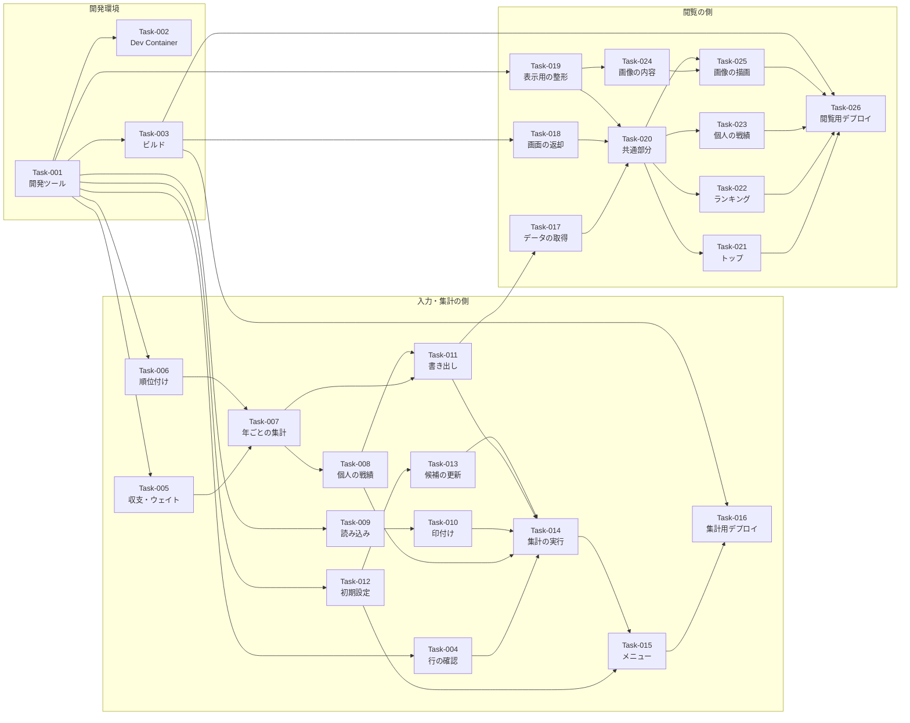

# 実装計画書

| 項目 | 内容 |
|---|---|
| 工程 | c1 実装計画 |
| plan ファイル | `plans/c1_implementation-plan.md` |
| 入力 | `docs/b1_design/component-design.md`、`docs/b1_design/decisions/` |
| 最終更新 | 2026-09-26 22:56 |

## 1. 概要

### 対象範囲

| 対象 | 由来 |
|---|---|
| Component-001〜Component-008（すべて） | component-design.md 4. コンポーネント |
| 開発環境の準備（ツールの設定、Dev Container、ビルド） | c1/Question-001〜006、010、012 |
| デプロイ用のスクリプト（集計用・閲覧用） | CLAUDE.md 4.（デプロイ）、Decision-0007、c1/Question-007、007-1 |

### 対象外

| 対象外 | 根拠 | 由来 |
|---|---|---|
| スケジュール（Constraint-005：目安 1 か月） | 実装の範囲・スケジュールは開発者が決める。本計画では依存関係と順序のみを定める | c1 スキル「役割」 |
| デプロイの実行、スクリプトプロパティの設定、閲覧者の招待（共有設定） | 開発者が行う。手順は c3・d1 で作成する | CLAUDE.md 4.、Quality-003、c1/Question-008 |
| git コマンドの実行（コミット、ブランチ、プッシュ、プルリクエスト） | 開発者のみが実行する。AI はコミットの区切りとコマンドの案を示すだけとする | c1/Question-011 |

## 2. 開発の前提

| 項目 | 内容 | 由来 |
|---|---|---|
| ディレクトリ構成 | 下記参照。`src/aggregate/`（集計用）、`src/viewer/`（閲覧用）、`tests/`。GAS に送るファイルはビルド用のスクリプトで `dist/aggregate/`・`dist/viewer/` に生成する | c1/Question-001、Decision-0007 |
| プログラミング言語 | JavaScript。GAS のコードは全ファイルが同じ場所（グローバル）で動くため、ローカルのテストから読み込めるよう、各ファイルの末尾で `module` がある場合のみ関数を公開する | Decision-0005、c1/Question-001 |
| 画面の実装 | HTML・CSS・JavaScript のみ（外部ライブラリなし）。画面の JavaScript は `.js` で書き、ビルド時に HTML に埋め込む | Decision-0003、c1/Question-001 |
| コーディング規約・フォーマッタ | Prettier（標準の設定） | c1/Question-002 |
| 静的解析ツール | ESLint（推奨ルール ＋ GAS の組み込みオブジェクト（`SpreadsheetApp`、`HtmlService`、`PropertiesService` 等）を既知として登録） | c1/Question-003 |
| 脆弱性チェックツール | `npm audit` | c1/Question-004 |
| 脆弱性の許容する基準 | Moderate 以上を不合格とする（`npm audit --audit-level=moderate` で 0 件） | c1/Question-005 |
| テストの実行環境とツール | Node.js（Dev Container 内）＋ Jest。GAS の組み込みオブジェクト（`SpreadsheetApp` 等）は Jest の代用品（`jest.fn()` 等）に置き換える。画面の DOM・canvas に依存する部分は、表示内容を作る純粋な関数を分けて Small テストの対象とし、DOM・canvas・デプロイ先での動作は c3 で定める Medium・Large テストで確認する | c1/Question-006、c1/Question-010、component-design.md 7.（テストのしやすさ） |
| デプロイの方法 | `clasp` を用いたスクリプト（`npm run deploy:aggregate`、`npm run deploy:viewer`）。ビルドしてから `clasp push` する。Web アプリは同じデプロイを更新して URL を変えない。GAS に送るのは `dist/aggregate/`・`dist/viewer/` の中のファイルのみ（`.clasp.json` の `rootDir` で限定）。GAS のプロジェクト・スプレッドシートは、開発者が作成した 1 つの Google ドライブのフォルダにのみ作成・保存する | c1/Question-007、c1/Question-007-1 |
| 設定値（スプレッドシートの ID） | 閲覧用スプレッドシートの ID を、集計用・閲覧用のプロジェクトのスクリプトプロパティ `VIEWER_SPREADSHEET_ID` に開発者が手作業で設定する（Git に含めない） | c1/Question-008 |
| ブランチ運用 | 作業ブランチで作業し、プルリクエストで `main` に取り込む。git コマンドは開発者のみが実行する。コミットメッセージは `[Task-001] 日本語の概要` の形式 | c1/Question-011、CLAUDE.md 10. |
| 依存ライブラリの管理方法 | npm で開発用の依存ライブラリ（devDependencies：Prettier、ESLint、Jest、`@google/clasp`）のみを管理し、`package-lock.json` を Git で管理する。GAS 上で動くコードは外部ライブラリを使わない | c1/Question-012、Decision-0003 |
| Dev Container | 使う。`.devcontainer/devcontainer.json` に依存ライブラリの導入（`npm ci`）を追加する。`clasp` のログインはコンテナ内で行い、認証情報をホストからマウントしない | c1/Question-010 |

### `clasp` のセキュリティに関する注意事項

開発者が `clasp` を初めて使うため、次を開発の前提とし、d1（セットアップ手順）の手順書で詳しく扱う。（由来：c1/Question-007 の開発者回答）

| 注意事項 | 内容 | 由来 |
|---|---|---|
| 認証情報の保管 | `clasp login` の認証情報（`~/.clasprc.json`）は秘密情報であり、Git の管理対象外とし、他人と共有しない。ホストからコンテナにマウントしない | c1/Question-007、c1/Question-010 |
| プロジェクトの設定ファイル | `.clasp.json`（スクリプト ID と `rootDir`）は Git の管理対象外とし、項目の説明を記載した見本（`.clasp.json.example`）のみを Git で管理する | c1/Question-008（公開するリポジトリに含める情報を減らす）、c1/Question-007-1 |
| 送るファイルの範囲 | `rootDir` を `dist/aggregate/`・`dist/viewer/` に限定し、`src/`・`tests/`・設定ファイル・認証情報を GAS に送らない | c1/Question-007-1 |
| 保存先の限定 | GAS のプロジェクト・スプレッドシートは、開発者が作成した 1 つの Google ドライブのフォルダにのみ置く | c1/Question-007-1、Quality-002、Quality-003 |
| 権限の確認 | ログイン時・初回実行時に求められる権限を確認する。集計用はスプレッドシートの読み書きとメニューの表示、閲覧用はスプレッドシートの読み取りのみ | Decision-0007 |

### ディレクトリ構成

```
poker-ranking/
├── .devcontainer/devcontainer.json   # Task-002 で依存ライブラリの導入を追加
├── .gitignore                        # Task-001 で dist/、node_modules/、.clasp.json、.clasprc.json を追加
├── package.json / package-lock.json  # Task-001
├── eslint.config.js / jest.config.js # Task-001
├── scripts/
│   ├── build.js                      # Task-003：dist/ の生成
│   └── deploy.js                     # Task-016・026：ビルドと clasp push・deploy
├── deploy/
│   ├── aggregate/.clasp.json.example # Task-016（.clasp.json は Git の管理対象外）
│   └── viewer/.clasp.json.example    # Task-026
├── src/
│   ├── aggregate/                    # 集計用プロジェクト（Component-001〜004）
│   │   ├── appsscript.json
│   │   ├── validate.js               # Task-004
│   │   ├── calc.js                   # Task-005
│   │   ├── rank.js                   # Task-006
│   │   ├── aggregate.js              # Task-007
│   │   ├── player.js                 # Task-008
│   │   ├── input-access.js           # Task-009・010
│   │   ├── viewer-writer.js          # Task-011
│   │   ├── setup.js                  # Task-012・013
│   │   ├── run.js                    # Task-014
│   │   └── menu.js                   # Task-015
│   └── viewer/                       # 閲覧用プロジェクト（Component-006〜008）
│       ├── appsscript.json
│       ├── server.js                 # Task-017・018
│       └── client/
│           ├── index.html            # ビルド時に CSS・JavaScript を埋め込む
│           ├── style.css
│           ├── format.js             # Task-019
│           ├── app.js                # Task-020
│           ├── screen-top.js         # Task-021
│           ├── screen-ranking.js     # Task-022
│           ├── screen-player.js      # Task-023
│           ├── image-layout.js       # Task-024
│           └── image-draw.js         # Task-025
├── tests/
│   ├── small/aggregate/              # 集計用の Small テスト
│   ├── small/viewer/                 # 閲覧用の Small テスト
│   └── small/scripts/                # ビルドの Small テスト
└── dist/                             # ビルドの出力（Git の管理対象外）
```

（由来：c1/Question-001、c1/Question-007-1、c1/Question-008、Decision-0007。ファイル名は c2 で変更してよく、変更した場合は `implementation-design.md` に記載する）

### 全タスク共通の完了条件

| 完了条件 | 確認の方法 | 由来 |
|---|---|---|
| ビルドが成功する | `npm run build` | c1 スキル、c1/Question-001 |
| 静的解析ツールの指摘が 0 件 | `npm run lint` | c1 スキル、c1/Question-003 |
| 脆弱性チェックで Moderate 以上の脆弱性が 0 件 | `npm audit --audit-level=moderate` | c1 スキル、c1/Question-004、005 |
| テスト期待値を確認する Small テストがすべて成功する | `npm test` | c1 スキル、CLAUDE.md 4. |
| `docs/c2_implement/implementation-design.md` が更新されている | 目視 | c1 スキル |

## 3. タスク一覧

| Task | 名称 | Component | 対応する要件 | 依存するタスク |
|---|---|---|---|---|
| Task-001 | 開発ツールの設定 | 開発環境 | Quality-009 | なし |
| Task-002 | Dev Container への追加 | 開発環境 | Quality-009 | Task-001 |
| Task-003 | ビルド用のスクリプト | 開発環境 | Quality-009 | Task-001 |
| Task-004 | 行の確認 | Component-003 | Feature-001、Feature-011 | Task-001 |
| Task-005 | 収支・ウェイト・端数の計算 | Component-003 | Feature-003、Feature-004 | Task-001 |
| Task-006 | 順位付け | Component-003 | Feature-007、Feature-008、Feature-012 | Task-001 |
| Task-007 | 年ごとの集計と 3 つのランキング | Component-003 | Feature-004〜Feature-007 | Task-005、Task-006 |
| Task-008 | 個人の戦績の集計 | Component-003 | Feature-010 | Task-007 |
| Task-009 | 入力用スプレッドシートの読み込み | Component-004 | Feature-001、Feature-002 | Task-001 |
| Task-010 | 除外した行の印付け | Component-004 | Feature-001 | Task-009 |
| Task-011 | 閲覧用スプレッドシートへの書き出し | Component-004、Component-005 | Feature-007〜Feature-010、Quality-001 | Task-007、Task-008 |
| Task-012 | 入力用スプレッドシートの初期設定 | Component-001 | Feature-001、Feature-002、Quality-007 | Task-001 |
| Task-013 | ニックネームの候補の更新 | Component-001 | Feature-001 | Task-012 |
| Task-014 | 集計の実行の処理の流れ | Component-002 | Feature-001、Feature-002、Feature-011 | Task-004、Task-007〜Task-011、Task-013 |
| Task-015 | メニュー | Component-002 | Feature-001、Quality-002 | Task-012、Task-014 |
| Task-016 | 集計用のデプロイ用スクリプト | 開発環境（集計用） | Quality-009 | Task-003、Task-015 |
| Task-017 | データの取得 | Component-006 | Feature-007〜Feature-010、Quality-001 | Task-011 |
| Task-018 | 画面の返却 | Component-006 | Feature-008、Quality-005 | Task-003 |
| Task-019 | 表示用の整形 | Component-007 | Feature-006、Feature-010、Feature-013 | Task-001 |
| Task-020 | 画面の共通部分 | Component-007 | Feature-007、Feature-013、Quality-001 | Task-017〜Task-019 |
| Task-021 | Screen-001 トップ画面 | Component-007 | Feature-008 | Task-020 |
| Task-022 | Screen-002〜004 ランキング画面 | Component-007 | Feature-004〜Feature-006、Feature-009 | Task-020 |
| Task-023 | Screen-005 個人の戦績画面 | Component-007 | Feature-010 | Task-020 |
| Task-024 | 画像に描く内容の計算 | Component-008 | Feature-012 | Task-019 |
| Task-025 | 画像の描画と Screen-006 | Component-008 | Feature-012 | Task-020、Task-024 |
| Task-026 | 閲覧用のデプロイ用スクリプト | 開発環境（閲覧用） | Quality-001、Quality-009 | Task-003、Task-017〜Task-025 |

## 4. タスクの詳細

<!-- 各タスクの完了条件には、「2. 開発の前提」の「全タスク共通の完了条件」を含む。 -->

### Task-001：開発ツールの設定

- Component：開発環境（責務：開発ツールの設定）
- 対応する要件：Quality-009
- 依存するタスク：なし
- 作業内容：`package.json`（devDependencies：Prettier、ESLint、Jest、`@google/clasp`）と npm スクリプト（`build`、`test`、`lint`、`format`、`audit`、`deploy:aggregate`、`deploy:viewer`）、ESLint・Jest の設定、`.gitignore` への追記（`dist/`、`node_modules/`、`.clasp.json`、`.clasprc.json`）
- 作成・更新する予定のファイル：`package.json`、`package-lock.json`、`eslint.config.js`、`jest.config.js`、`.prettierignore`、`.gitignore`
- 完了条件：
  - 全タスク共通の完了条件
  - `.gitignore` に `.clasp.json`、`.clasprc.json`、`dist/`、`node_modules/` が含まれる（由来：c1 スキル「秘密情報を Git の管理対象外とする」、c1/Question-007、008）
- テスト期待値の概要：Small テストの対象なし（設定ファイルのみ）。全タスク共通の完了条件のコマンドが実行できることで確認する。

### Task-002：Dev Container への追加

- Component：開発環境（責務：Dev Container）
- 対応する要件：Quality-009
- 依存するタスク：Task-001
- 作業内容：`.devcontainer/devcontainer.json` の `postCreateCommand` に依存ライブラリの導入（`npm ci`）を追加する。認証情報をホストからマウントしない
- 作成・更新する予定のファイル：`.devcontainer/devcontainer.json`
- 完了条件：
  - 全タスク共通の完了条件
  - `mounts` にホストの認証情報（`~/.clasprc.json` 等）が含まれない（由来：c1/Question-010）
- テスト期待値の概要：Small テストの対象なし（設定ファイルのみ）。コンテナの作成と `npm test` の実行は開発者が確認する（由来：c1/Question-010、CLAUDE.md 4.）。

### Task-003：ビルド用のスクリプト

- Component：開発環境（責務：ビルド）
- 対応する要件：Quality-009
- 依存するタスク：Task-001
- 作業内容：`src/aggregate/` から `dist/aggregate/`、`src/viewer/` から `dist/viewer/` を生成する。画面の CSS・JavaScript を `index.html` に埋め込む。ローカルのテスト用の公開部分は GAS 上で動作に影響しない形で残す
- 作成・更新する予定のファイル：`scripts/build.js`、`tests/small/scripts/build.test.js`
- 完了条件：全タスク共通の完了条件
- テスト期待値の概要：

  | # | 条件 | 期待される結果 | 由来 |
  |---|---|---|---|
  | 1 | `src/aggregate/` に `.js` と `appsscript.json` がある | `dist/aggregate/` に同じ `.js` と `appsscript.json` のみが出力される（`tests/`・設定ファイルは含まれない） | c1/Question-001、c1/Question-007-1 |
  | 2 | `src/viewer/client/` に `index.html`・`style.css`・`.js` がある | `dist/viewer/` に `server.js`、`appsscript.json`、CSS と JavaScript を埋め込んだ HTML が出力され、`client/` の `.js`・`.css` は個別のファイルとして出力されない | c1/Question-001 |
  | 3 | 前回のビルドの出力が `dist/` に残っている | 前回の出力は消され、今回の出力のみになる | c1/Question-007-1（送るファイルを限定する） |

### Task-004：行の確認

- Component：Component-003（責務：行の確認）
- 対応する要件：Feature-001、Feature-011
- 依存するタスク：Task-001
- 作業内容：プレイ結果の 1 行を受け取り、有効かどうかと、前後の空白を取り除いたニックネームを返す
- 作成・更新する予定のファイル：`src/aggregate/validate.js`、`tests/small/aggregate/validate.test.js`
- 完了条件：全タスク共通の完了条件
- テスト期待値の概要：

  | # | 条件 | 期待される結果 | 由来 |
  |---|---|---|---|
  | 1 | プレイヤー名「ナッツ」、プレイ日付 2026/09/13（日付）、プレイ時間 1.5、最終チップ数 25000、借金回数 1 | 有効 | Feature-001 条件1・条件2、Component-003 |
  | 2 | 5 項目のいずれかが空欄 | 無効 | b1/Question-008 |
  | 3 | プレイ日付が日付でない（例：文字列「abc」） | 無効 | b1/Question-007 (a)、b1/Question-008 |
  | 4 | プレイ時間・最終チップ数・借金回数のいずれかが数値でない（例：文字列「abc」） | 無効 | b1/Question-007 (a)、b1/Question-008 |
  | 5 | プレイ時間・最終チップ数・借金回数のいずれかがマイナス（例：-1） | 無効 | b1/Question-020、c1/Question-017-1 |
  | 6 | プレイ時間 0、借金回数 0.5、最終チップ数 100.5 | 有効（0・小数も有効） | c1/Question-017-1 |
  | 7 | プレイヤー名「 ナッツ 」（前後に空白） | 有効。ニックネームは「ナッツ」 | b1/Question-007 (c) |
  | 8 | プレイヤー名が空白のみ | 無効（空欄として扱う） | b1/Question-007 (c)、b1/Question-008 |

### Task-005：収支・ウェイト・端数の計算

- Component：Component-003（責務：収支・ウェイト・端数の計算）
- 対応する要件：Feature-003、Feature-004
- 依存するタスク：Task-001
- 作業内容：収支、ウェイト、整数への四捨五入（マイナスは絶対値で四捨五入）の関数を作る
- 作成・更新する予定のファイル：`src/aggregate/calc.js`、`tests/small/aggregate/calc.test.js`
- 完了条件：全タスク共通の完了条件
- テスト期待値の概要：

  | # | 条件 | 期待される結果 | 由来 |
  |---|---|---|---|
  | 1 | 最終チップ数 25000、配布チップ数 20000、借金回数 1 | 収支 5000 | Feature-003 条件1 |
  | 2 | 最終チップ数 10000、配布チップ数 20000、借金回数 2 | 収支 -30000（マイナスになる） | Feature-003 条件1 |
  | 3 | プレイ時間 0.5、1、1.5、2、3 | ウェイト 0.5、約 0.7071、約 0.8660、1、1（上限 100%） | Feature-004 条件2 |
  | 4 | プレイ時間 0 | ウェイト 0 | Feature-004 条件2、c1/Question-017-1 |
  | 5 | 丸める値 1234.4、1234.5、2.5 | 1234、1235、3 | c1/Question-013、c1/Question-019 |
  | 6 | 丸める値 -2.5、-2.4 | -3、-2（絶対値で四捨五入） | c1/Question-019 |

### Task-006：順位付け

- Component：Component-003（責務：順位付け）
- 対応する要件：Feature-007、Feature-008、Feature-012
- 依存するタスク：Task-001
- 作業内容：値とニックネームの組の一覧を受け取り、並べ替えの向き（大きい順／小さい順）に従って順位を付け、表示の順に並べる。順位が 5 位以内のプレイヤーを取り出す関数を作る
- 作成・更新する予定のファイル：`src/aggregate/rank.js`、`tests/small/aggregate/rank.test.js`
- 完了条件：全タスク共通の完了条件
- テスト期待値の概要：

  | # | 条件 | 期待される結果 | 由来 |
  |---|---|---|---|
  | 1 | 値 300、100、100、50（大きい順） | 順位 1 位、2 位、2 位、4 位 | Feature-007 条件3 |
  | 2 | 値 -300、-100、-50（小さい順） | 順位 1 位（-300）、2 位（-100）、3 位（-50） | Feature-006 条件1 |
  | 3 | 同じ値のニックネーム「ナッツ」「Joker」「ぶらふ」 | 同じ順位で、文字コード順に「Joker」「ぶらふ」「ナッツ」の順に並ぶ | c1/Question-014、c1/Question-014-1 |
  | 4 | 順位が 1、2、3、4、5、5、7 位の 7 人 | 5 位以内の 6 人が取り出される | c1/Question-015 |
  | 5 | 一覧が空 | 空の一覧を返す | Feature-006 条件1-2 |

### Task-007：年ごとの集計と 3 つのランキング

- Component：Component-003（責務：年ごとの集計とランキング）
- 対応する要件：Feature-004〜Feature-007
- 依存するタスク：Task-005、Task-006
- 作業内容：有効な行と設定値（配布チップ数、N）を受け取り、暦年ごとにアベレージランキング・累計ランキング・強制労働への道のりと、集計済みの年の一覧を作る
- 作成・更新する予定のファイル：`src/aggregate/aggregate.js`、`tests/small/aggregate/aggregate.test.js`
- 完了条件：全タスク共通の完了条件
- テスト期待値の概要：

  | # | 条件 | 期待される結果 | 由来 |
  |---|---|---|---|
  | 1 | 2025/12/31 と 2026/01/01 の行がある | 2026 年の集計には 2026/01/01 の行のみが含まれる | Feature-007 条件1 |
  | 2 | 2025 年と 2026 年の行がある | 集計済みの年の一覧は 2025、2026 | Feature-007 条件2 |
  | 3 | あるプレイヤーの 2 日分（収支 10000・2 時間、収支 -5000・0.5 時間） | アベレージランキングの値は（10000 × 1 ＋ -5000 × 0.5）÷ 2 ＝ 3750 | Feature-004 条件1・条件2 |
  | 4 | 参加日数が 1 日のプレイヤー | アベレージランキングに含まれる | Feature-004 条件3 |
  | 5 | 同じプレイヤー・同じ日付の 2 行（収支 4000・2 時間、収支 2000・2 時間） | 参加日数 1 日、アベレージランキングの値は（4000 ＋ 2000）÷ 1 ＝ 6000、累計チップ数は 6000 | c1/Question-016 |
  | 6 | アベレージランキングの値が 1234.5 と 1234.6 の 2 人 | どちらも 1235 となり、同じ順位 | c1/Question-013 |
  | 7 | 収支の合計が 44200、-8800、9500 の 3 人 | 累計ランキングは 44200、9500、-8800 の順（全員が対象） | Feature-005 条件1 |
  | 8 | 同上 | 強制労働への道のりは -8800 の 1 人のみ | Feature-006 条件1 |
  | 9 | 基準値がマイナスのプレイヤーがいない | 強制労働への道のりは空（画面で「ランキングなし」） | Feature-006 条件1-2 |
  | 10 | 配布チップ数 20000、N 10、基準値 -200000 と -199999 | -200000 は「強制労働」に該当し、-199999 は該当しない | Feature-006 条件2・条件3 |
  | 11 | 2025 年の基準値が -150000 のプレイヤーが 2026 年に収支 -60000 | 2026 年の基準値は -60000（年ごとに数え直す） | Feature-006 条件4 |
  | 12 | 最終チップ数に小数がある（収支の合計 1000.5） | 累計チップ数・基準値は 1001（合計してから丸める） | c1/Question-019 |
  | 13 | 同じ行で配布チップ数を 20000 から 30000 に変えて集計する | すべての年の収支・ランキングが 30000 で計算される | Decision-0006 |

### Task-008：個人の戦績の集計

- Component：Component-003（責務：個人の戦績）
- 対応する要件：Feature-010
- 依存するタスク：Task-007
- 作業内容：年ごと・プレイヤーごとに、参加日数、合計プレイ時間、収支の累計（基準値）、平均値チップ数、借金回数の累計、強制労働までの残りチップ数、各ランキングでの順位、実施日ごとの履歴を作る
- 作成・更新する予定のファイル：`src/aggregate/player.js`、`tests/small/aggregate/player.test.js`
- 完了条件：全タスク共通の完了条件
- テスト期待値の概要：

  | # | 条件 | 期待される結果 | 由来 |
  |---|---|---|---|
  | 1 | あるプレイヤーの 3 日分（プレイ時間 2.0、1.5、3.0、借金回数 0、1、0） | 参加日数 3 日、合計プレイ時間 6.5、借金回数の累計 1 | Feature-010 条件1 |
  | 2 | 基準値 44200、配布チップ数 20000、N 10 | 強制労働までの残りチップ数 244200 | Feature-010 条件1 |
  | 3 | 基準値 -210000、配布チップ数 20000、N 10 | 強制労働までの残りチップ数 -10000（0 以下） | Feature-010 条件1 |
  | 4 | 基準値が 0 以上のプレイヤー | 強制労働への道のりの順位は「なし」（画面で「−」） | Feature-010 条件2-2 |
  | 5 | 基準値がマイナスのプレイヤー | 3 つのランキングすべての順位を持つ | Feature-010 条件1 |
  | 6 | 実施日が 2026/08/16、2026/09/13、2026/08/30 の行 | 履歴は新しい日付から（09/13、08/30、08/16）、各行に日付・時間・最終チップ・借金・収支を持つ | Feature-010 条件1、component-design.md 8.（Screen-005） |
  | 7 | 同じ日付の 2 行 | 履歴に 2 行とも含まれ、参加日数は 1 日 | c1/Question-016 |

### Task-009：入力用スプレッドシートの読み込み

- Component：Component-004（責務：入力用の読み込み）
- 対応する要件：Feature-001、Feature-002
- 依存するタスク：Task-001
- 作業内容：シート「プレイ結果」の見出し行を除く全行（行番号付き）と、シート「設定」の配布チップ数・N を読み込む
- 作成・更新する予定のファイル：`src/aggregate/input-access.js`、`tests/small/aggregate/input-access.test.js`
- 完了条件：全タスク共通の完了条件
- テスト期待値の概要：

  | # | 条件 | 期待される結果 | 由来 |
  |---|---|---|---|
  | 1 | 代用品のシート「プレイ結果」に見出し行とデータ 2 行 | 2 件の行が、シート上の行番号（2、3）付きで返る | Component-004 |
  | 2 | 代用品のシート「設定」に配布チップ数 20000、N 10 | 配布チップ数 20000、N 10 が返る | Feature-002 条件1・条件2 |
  | 3 | 代用品のシート「設定」の配布チップ数が空欄 | 空欄のまま返る（判断は Task-014） | b1/Question-019 |

### Task-010：除外した行の印付け

- Component：Component-004（責務：行の印付け）
- 対応する要件：Feature-001
- 依存するタスク：Task-009
- 作業内容：データ行の前回の印（背景色）を消し、指定した行番号の行に印を付ける
- 作成・更新する予定のファイル：`src/aggregate/input-access.js`、`tests/small/aggregate/input-access.test.js`
- 完了条件：全タスク共通の完了条件
- テスト期待値の概要：

  | # | 条件 | 期待される結果 | 由来 |
  |---|---|---|---|
  | 1 | 除外する行番号 3、5 | データ行の背景色が消されたうえで、3 行目と 5 行目に背景色が付く | b1/Question-008、Component-002（処理の流れ 2.） |
  | 2 | 除外する行がない | データ行の背景色が消され、新たな印は付かない | Component-002（処理の流れ 2.） |

### Task-011：閲覧用スプレッドシートへの書き出し

- Component：Component-004（責務：閲覧用への書き出し）、Component-005（シートの構成）
- 対応する要件：Feature-007〜Feature-010、Quality-001
- 依存するタスク：Task-007、Task-008
- 作業内容：スクリプトプロパティ `VIEWER_SPREADSHEET_ID` の閲覧用スプレッドシートの 4 シート（集計情報、ランキング、個人の戦績、履歴）の内容を、集計結果で置き換える
- 作成・更新する予定のファイル：`src/aggregate/viewer-writer.js`、`tests/small/aggregate/viewer-writer.test.js`
- 完了条件：全タスク共通の完了条件
- テスト期待値の概要：

  | # | 条件 | 期待される結果 | 由来 |
  |---|---|---|---|
  | 1 | 集計結果と集計日時 | 4 シートの前回の内容が消され、集計情報（集計日時、集計済みの年）、ランキング、個人の戦績、履歴の各行が書き込まれる | component-design.md 5.、Decision-0006 |
  | 2 | 集計結果の個人の戦績に、強制労働への道のりの対象外のプレイヤー | その順位の欄は空欄 | component-design.md 5.、Feature-010 条件2-2 |
  | 3 | スクリプトプロパティ `VIEWER_SPREADSHEET_ID` が未設定 | 書き出しを行わず、失敗として呼び出し元に返す | c1/Question-008、component-design.md 7.（エラー処理） |
  | 4 | 書き込む値にニックネーム以外の個人を特定できる情報がない | 書き出す列は component-design.md 5. のシート構成のみ | Quality-008 |

### Task-012：入力用スプレッドシートの初期設定

- Component：Component-001（責務：シート・入力規則・設定の初期値の作成）
- 対応する要件：Feature-001、Feature-002、Quality-007
- 依存するタスク：Task-001
- 作業内容：シート「プレイ結果」（見出し：プレイヤー名、プレイ日付、プレイ時間、最終チップ数、借金回数。日付・数値の入力規則）と、シート「設定」（配布チップ数：空欄、強制労働の基準の回数 N：10）を作る
- 作成・更新する予定のファイル：`src/aggregate/setup.js`、`tests/small/aggregate/setup.test.js`
- 完了条件：全タスク共通の完了条件
- テスト期待値の概要：

  | # | 条件 | 期待される結果 | 由来 |
  |---|---|---|---|
  | 1 | 代用品のスプレッドシートにシートがない | シート「プレイ結果」が 5 列の見出しで作られ、プレイ日付に日付、プレイ時間・最終チップ数・借金回数に数値の入力規則が設定される | Feature-001 条件1、b1/Question-007 (a)、c1/Question-009 |
  | 2 | 同上 | シート「設定」に配布チップ数（空欄）と N（10）が作られる | Feature-002 条件2、b1/Question-019、c1/Question-009 |
  | 3 | シート「プレイ結果」「設定」がすでにあり、データが入っている | 既存のシートとデータは変更・削除されない | Quality-007（データは削除しない限り残る） |

### Task-013：ニックネームの候補の更新

- Component：Component-001（責務：ニックネームの候補）
- 対応する要件：Feature-001
- 依存するタスク：Task-012
- 作業内容：有効な行のニックネーム（前後の空白を除去、重複なし）を、プレイヤー名の列の候補として設定する。候補にない名前も入力できる設定とする
- 作成・更新する予定のファイル：`src/aggregate/setup.js`、`tests/small/aggregate/setup.test.js`
- 完了条件：全タスク共通の完了条件
- テスト期待値の概要：

  | # | 条件 | 期待される結果 | 由来 |
  |---|---|---|---|
  | 1 | ニックネーム「ナッツ」「 ナッツ」「リバー」 | 候補は「ナッツ」「リバー」の 2 つ | b1/Question-007 (b)・(c) |
  | 2 | 候補を設定する | 候補にない名前の入力を拒否しない設定になる | Feature-001 条件4、b1/Question-007 (b) |

### Task-014：集計の実行の処理の流れ

- Component：Component-002（責務：集計の実行の処理の流れ）
- 対応する要件：Feature-001、Feature-002、Feature-011
- 依存するタスク：Task-004、Task-007〜Task-011、Task-013
- 作業内容：設定値の確認 → 行の確認と印付け → 集計 → 閲覧用への書き出し → ニックネームの候補の更新 → 管理者へのメッセージ、の順に呼び出す
- 作成・更新する予定のファイル：`src/aggregate/run.js`、`tests/small/aggregate/run.test.js`
- 完了条件：全タスク共通の完了条件
- テスト期待値の概要：

  | # | 条件 | 期待される結果 | 由来 |
  |---|---|---|---|
  | 1 | 配布チップ数が空欄、または数値でない | 集計を中止し、管理者にメッセージを表示する。書き出し・印付けは行わない | b1/Question-019、Component-002（処理の流れ 1.） |
  | 2 | N が空欄、または数値でない | 同上 | b1/Question-019 |
  | 3 | 有効な行 3 件と無効な行 1 件（4 行目） | 4 行目に印が付き、3 件で集計・書き出しが行われ、完了のメッセージに除外した行の数 1 が含まれる | b1/Question-008、Component-002（処理の流れ 2.〜4.） |
  | 4 | 書き出しが失敗した | 管理者に失敗のメッセージを表示する | component-design.md 7.（エラー処理） |
  | 5 | 集計が成功した | ニックネームの候補が更新される | c1/Question-009 |
  | 6 | 行を修正・削除してから実行する | 修正後の行のみで集計される（前回の結果は置き換えられる） | Feature-011 条件1・条件2、Decision-0002 |

### Task-015：メニュー

- Component：Component-002（責務：メニュー）
- 対応する要件：Feature-001、Quality-002
- 依存するタスク：Task-012、Task-014
- 作業内容：入力用スプレッドシートを開いたときに、メニュー「集計を反映」「初期設定」を追加する
- 作成・更新する予定のファイル：`src/aggregate/menu.js`、`tests/small/aggregate/menu.test.js`
- 完了条件：全タスク共通の完了条件
- テスト期待値の概要：

  | # | 条件 | 期待される結果 | 由来 |
  |---|---|---|---|
  | 1 | 入力用スプレッドシートを開く（代用品の `SpreadsheetApp.getUi()`） | 「集計を反映」と「初期設定」の 2 つの項目を持つメニューが追加される | Decision-0002、c1/Question-009 |

### Task-016：集計用のデプロイ用スクリプト

- Component：開発環境（責務：集計用のデプロイ）
- 対応する要件：Quality-009
- 依存するタスク：Task-003、Task-015
- 作業内容：`npm run deploy:aggregate` でビルドし、`clasp push` で `dist/aggregate/` の中のファイルのみを送る。`src/aggregate/appsscript.json` にスプレッドシートの読み書きとメニューの表示の権限を記載する。`deploy/aggregate/.clasp.json.example` を作る
- 作成・更新する予定のファイル：`scripts/deploy.js`、`src/aggregate/appsscript.json`、`deploy/aggregate/.clasp.json.example`
- 完了条件：
  - 全タスク共通の完了条件
  - `.clasp.json`・`.clasprc.json` が Git の管理対象外である（由来：c1 スキル「秘密情報を Git の管理対象外とする」、c1/Question-007、008）
  - `.clasp.json.example` の `rootDir` が `dist/aggregate/` を指す（由来：c1/Question-007-1）
- テスト期待値の概要：Small テストの対象なし。デプロイは開発者が行い、デプロイ後の確認は c3 で定める（由来：CLAUDE.md 4.）。

### Task-017：データの取得

- Component：Component-006（責務：データの取得）
- 対応する要件：Feature-007〜Feature-010、Quality-001
- 依存するタスク：Task-011
- 作業内容：年を指定して、閲覧用スプレッドシートからその年のランキング・個人の戦績・履歴と、集計日時・集計済みの年の一覧を読み込んで返す
- 作成・更新する予定のファイル：`src/viewer/server.js`、`tests/small/viewer/server.test.js`
- 完了条件：全タスク共通の完了条件
- テスト期待値の概要：

  | # | 条件 | 期待される結果 | 由来 |
  |---|---|---|---|
  | 1 | 代用品の閲覧用スプレッドシートに 2025 年・2026 年の結果、年 2026 を指定 | 2026 年のランキング・個人の戦績・履歴のみと、集計日時、年の一覧（2025、2026）が返る | Feature-007 条件1・条件2 |
  | 2 | 年を指定しない | 集計済みの年のうち最新の年（2026）の結果が返る | c1/Question-020 |
  | 3 | 閲覧用スプレッドシートを開けない（代用品が例外を返す：共有されていないアカウント） | データを返さず、閲覧できない旨を返す | Quality-001、Decision-0001、component-design.md 7.（エラー処理） |
  | 4 | スクリプトプロパティ `VIEWER_SPREADSHEET_ID` が未設定 | データを返さず、閲覧できない旨を返す | c1/Question-008、component-design.md 7.（エラー処理） |

### Task-018：画面の返却

- Component：Component-006（責務：画面の返却）
- 対応する要件：Feature-008、Quality-005
- 依存するタスク：Task-003
- 作業内容：Web アプリの URL を開いたときに、ビルドした HTML を返す
- 作成・更新する予定のファイル：`src/viewer/server.js`、`src/viewer/client/index.html`、`tests/small/viewer/server.test.js`
- 完了条件：全タスク共通の完了条件
- テスト期待値の概要：

  | # | 条件 | 期待される結果 | 由来 |
  |---|---|---|---|
  | 1 | Web アプリを開く（代用品の `HtmlService`） | 画面の HTML が返り、タイトルは「POKER RANKING」、スマートフォン向けの表示設定（viewport）が付く | b1/Question-015-1、Quality-005 |

### Task-019：表示用の整形

- Component：Component-007（責務：表示用の整形）
- 対応する要件：Feature-006、Feature-010、Feature-013
- 依存するタスク：Task-001
- 作業内容：文字列の無害化、数値・順位の表示形式、強制労働の順位・残りチップ数・ゲージの割合の表示の関数を作る
- 作成・更新する予定のファイル：`src/viewer/client/format.js`、`tests/small/viewer/format.test.js`
- 完了条件：全タスク共通の完了条件
- テスト期待値の概要：

  | # | 条件 | 期待される結果 | 由来 |
  |---|---|---|---|
  | 1 | 文字列 `<b>ナッツ&</b>` | `&lt;b&gt;ナッツ&amp;&lt;/b&gt;`（HTML として解釈されない） | b1/Question-018 |
  | 2 | 値 44200、-8800 | 「+44,200」「−8,800」 | 採用したモック（Screen-002、Screen-005） |
  | 3 | 順位 2 | 「2位」 | 採用したモック（Screen-002） |
  | 4 | 強制労働への道のりの順位なし | 「−」 | Feature-010 条件2-2、b1/review-002 |
  | 5 | 残りチップ数 244200 | 「244,200」 | Feature-010 条件1 |
  | 6 | 残りチップ数 0、-10000 | 「強制労働」（数値は表示しない） | c1/Question-022-1 |
  | 7 | 基準値 44200、配布チップ数 20000、N 10 | ゲージの割合 0% | c1/Question-022 |
  | 8 | 基準値 -50000、同上 | ゲージの割合 25% | c1/Question-022 |
  | 9 | 基準値 -250000、同上 | ゲージの割合 100%（上限） | c1/Question-022 |

### Task-020：画面の共通部分

- Component：Component-007（責務：画面の共通部分）
- 対応する要件：Feature-007、Feature-013、Quality-001
- 依存するタスク：Task-017〜Task-019
- 作業内容：年の選択、画面の切り替え、データの取得の呼び出し、閲覧できない旨の表示、免責表示。表示内容を作る処理（年の選択肢と最初の年）は DOM から分けた関数にする
- 作成・更新する予定のファイル：`src/viewer/client/app.js`、`src/viewer/client/index.html`、`src/viewer/client/style.css`、`tests/small/viewer/app.test.js`
- 完了条件：全タスク共通の完了条件
- テスト期待値の概要：

  | # | 条件 | 期待される結果 | 由来 |
  |---|---|---|---|
  | 1 | 集計済みの年 2025、2026 | 年の選択肢は 2026、2025 で、最初に選ばれる年は 2026 | Feature-007 条件2、c1/Question-020 |
  | 2 | 取得の結果が「閲覧できない」 | データの代わりに閲覧できない旨を表示する内容になる | Quality-001、component-design.md 8.（共通） |
  | 3 | 免責表示の文言 | 「本ページは有志が作成したものであり、開催店舗とは関係ありません。」 | Feature-013、b1/Question-015 |

### Task-021：Screen-001 トップ画面

- Component：Component-007（責務：トップ画面）
- 対応する要件：Feature-008
- 依存するタスク：Task-020
- 作業内容：3 つのランキングのカード（ランキング名、説明文、5 位以内のプレイヤー）と、各ランキング画面・画像生成画面へのリンクを表示する。表示内容を作る処理は DOM から分けた関数にする
- 作成・更新する予定のファイル：`src/viewer/client/screen-top.js`、`tests/small/viewer/screen-top.test.js`
- 完了条件：
  - 全タスク共通の完了条件
  - 見た目が採用したモック（`docs/b1_design/mockups/Screen-001.html`）に合致する（由来：Feature-008 条件3）
- テスト期待値の概要：

  | # | 条件 | 期待される結果 | 由来 |
  |---|---|---|---|
  | 1 | 3 つのランキングの結果 | アベレージ、累計、強制労働への道のりの順に、それぞれ 5 位以内のプレイヤー（同順位で 6 人以上もありうる）が並ぶ | Feature-008 条件1、c1/Question-015 |
  | 2 | 強制労働への道のりで「強制労働」に該当するプレイヤー | ニックネームの右側に「強制労働」のラベルを付ける内容になる | Feature-006 条件2、b1/review-007 |
  | 3 | 強制労働への道のりの対象者がいない | 「ランキングなし」を表示する内容になる | Feature-006 条件1-2 |
  | 4 | ランキング名・「すべて見る」 | 同じランキング画面への移動先を持つ | Feature-008 条件2、b1/review-003 |

### Task-022：Screen-002〜004 ランキング画面

- Component：Component-007（責務：ランキング画面）
- 対応する要件：Feature-004〜Feature-006、Feature-009
- 依存するタスク：Task-020
- 作業内容：3 つのランキングの切り替えと、全員の一覧（順位、ニックネーム、値、参加日数）、個人の戦績画面へのリンクを表示する。表示内容を作る処理は DOM から分けた関数にする
- 作成・更新する予定のファイル：`src/viewer/client/screen-ranking.js`、`tests/small/viewer/screen-ranking.test.js`
- 完了条件：
  - 全タスク共通の完了条件
  - 見た目が採用したモック（`docs/b1_design/mockups/Screen-002.html`）に合致する（由来：Feature-009 条件3）
- テスト期待値の概要：

  | # | 条件 | 期待される結果 | 由来 |
  |---|---|---|---|
  | 1 | アベレージ／累計／強制労働への道のり | 値の見出しはそれぞれ「平均値チップ数」「累計チップ数」「基準値」 | b1/Question-016、b1/review-006、component-design.md 8. |
  | 2 | ランキングの結果 | 対象者全員が順位の順に、順位・ニックネーム・値・参加日数を持つ行になる | Feature-009 条件1 |
  | 3 | 強制労働への道のりの対象者がいない | 「ランキングなし」を表示する内容になる | Feature-006 条件1-2 |
  | 4 | ニックネーム | そのプレイヤーの個人の戦績画面への移動先を持つ | Feature-009 条件2 |

### Task-023：Screen-005 個人の戦績画面

- Component：Component-007（責務：個人の戦績画面）
- 対応する要件：Feature-010
- 依存するタスク：Task-020
- 作業内容：数値のタイル、各ランキングでの順位、強制労働までの道のり（借金回数の累計、残りチップ数、ゲージ）、実施日ごとの履歴を表示する。表示内容を作る処理は DOM から分けた関数にする
- 作成・更新する予定のファイル：`src/viewer/client/screen-player.js`、`tests/small/viewer/screen-player.test.js`
- 完了条件：
  - 全タスク共通の完了条件
  - 見た目が採用したモック（`docs/b1_design/mockups/Screen-005.html`）に合致する（由来：Feature-010 条件3）
- テスト期待値の概要：

  | # | 条件 | 期待される結果 | 由来 |
  |---|---|---|---|
  | 1 | 表示中のプレイヤーの戦績がある年 | 参加日数、合計プレイ時間、収支の累計、平均値チップ数、各ランキングでの順位、借金回数の累計、残りチップ数、ゲージの割合、履歴を表示する内容になる | Feature-010 条件1 |
  | 2 | 自分以外のプレイヤー | 同じ内容を表示する | Feature-010 条件2 |
  | 3 | 表示中のプレイヤーが参加していない年を選ぶ | 「この年の戦績はありません」を表示する内容になる | c1/Question-021 |

### Task-024：画像に描く内容の計算

- Component：Component-008（責務：画像に描く内容の計算）
- 対応する要件：Feature-012
- 依存するタスク：Task-019
- 作業内容：表示中の年の集計結果から、画像の大きさ、アプリの名称、年と集計時点、3 つのランキングの 5 位以内のプレイヤー、免責表示を、描く順に並べた内容として作る
- 作成・更新する予定のファイル：`src/viewer/client/image-layout.js`、`tests/small/viewer/image-layout.test.js`
- 完了条件：全タスク共通の完了条件
- テスト期待値の概要：

  | # | 条件 | 期待される結果 | 由来 |
  |---|---|---|---|
  | 1 | 画像を作る | 大きさは 1080 × 1920 ピクセル（9:16） | Feature-012 条件1 |
  | 2 | 2026 年、集計日 2026/09/26 | 名称「POKER RANKING」、「2026 年（2026/01/01〜2026/09/26 時点）」を含む | b1/Question-015-1、採用したモック（Screen-006） |
  | 3 | 3 つのランキングの結果 | アベレージ、累計、強制労働への道のりの順に、それぞれ 5 位以内のプレイヤー（同順位で 6 人以上もありうる）を含む | Feature-012 条件1、c1/Question-015 |
  | 4 | 「強制労働」に該当するプレイヤー | ニックネームに「（強制労働）」を付ける | 採用したモック（Screen-006） |
  | 5 | 画像を作る | 免責表示の文言を含む | Feature-013、採用したモック（Screen-006） |

### Task-025：画像の描画と Screen-006

- Component：Component-008（責務：画像の描画）
- 対応する要件：Feature-012
- 依存するタスク：Task-020、Task-024
- 作業内容：Task-024 の内容を canvas に描き、画像として画面に表示する。保存の案内、「戻る」「画像を作り直す」を表示する。同順位で表示の人数が増えた場合の配置を調整する
- 作成・更新する予定のファイル：`src/viewer/client/image-draw.js`
- 完了条件：
  - 全タスク共通の完了条件
  - 見た目が採用したモック（`docs/b1_design/mockups/Screen-006.html`）に合致する（由来：Feature-012 条件3、c1/Question-015）
- テスト期待値の概要：Small テストの対象なし（canvas・端末の保存に依存する）。画像の見た目と長押しでの保存・共有は、c3 で定める Large テスト（実機のスマートフォン）で確認する（由来：component-design.md 7.（テストのしやすさ））。

### Task-026：閲覧用のデプロイ用スクリプト

- Component：開発環境（責務：閲覧用のデプロイ）
- 対応する要件：Quality-001、Quality-009
- 依存するタスク：Task-003、Task-017〜Task-025
- 作業内容：`npm run deploy:viewer` でビルドし、`clasp push` で `dist/viewer/` の中のファイルのみを送り、既存のデプロイを更新する（URL を変えない）。`src/viewer/appsscript.json` に Web アプリの公開設定（アクセスしたユーザーとして実行、Google アカウントを持つ全員）と、スプレッドシートの読み取りのみの権限を記載する。`deploy/viewer/.clasp.json.example` を作る
- 作成・更新する予定のファイル：`scripts/deploy.js`、`src/viewer/appsscript.json`、`deploy/viewer/.clasp.json.example`
- 完了条件：
  - 全タスク共通の完了条件
  - `.clasp.json`・`.clasprc.json` が Git の管理対象外である（由来：c1 スキル、c1/Question-007、008）
  - `src/viewer/appsscript.json` の権限がスプレッドシートの読み取りのみである（由来：Decision-0007）
  - `src/viewer/appsscript.json` の公開設定が、アクセスしたユーザーとして実行・Google アカウントを持つ全員である（由来：Decision-0001）
- テスト期待値の概要：Small テストの対象なし。アクセス制御（招待したアカウント・招待していないアカウント・未ログイン）は、c3 で定める Large テストで確認する（由来：component-design.md 7.（テストのしやすさ）、CLAUDE.md 4.）。

## 5. 実装の順序

<!-- 依存関係に従う。依存関係のないタスク同士は、開発者の指定（c1/Question-018）に従い、開発環境 → 入力・集計の側 → 閲覧の側の順とし、同じ段階の中は Task 番号順とする。 -->



| 順序 | Task | 順序の根拠 |
|---|---|---|
| 1 | Task-001 | 依存関係なし。すべてのタスクの前提 |
| 2 | Task-002 | Task-001 に依存。開発環境の段階（c1/Question-018） |
| 3 | Task-003 | Task-001 に依存。開発環境の段階（c1/Question-018） |
| 4 | Task-004 | Task-001 に依存。入力・集計の側を先に完成させる（c1/Question-018）、番号順 |
| 5 | Task-005 | 同上 |
| 6 | Task-006 | 同上 |
| 7 | Task-007 | Task-005・006 に依存 |
| 8 | Task-008 | Task-007 に依存 |
| 9 | Task-009 | Task-001 に依存。入力・集計の側、番号順 |
| 10 | Task-010 | Task-009 に依存 |
| 11 | Task-011 | Task-007・008 に依存 |
| 12 | Task-012 | Task-001 に依存。入力・集計の側、番号順 |
| 13 | Task-013 | Task-012 に依存 |
| 14 | Task-014 | Task-004、007〜011、013 に依存 |
| 15 | Task-015 | Task-012・014 に依存 |
| 16 | Task-016 | Task-003・015 に依存。入力・集計の側の完成 |
| 17 | Task-017 | Task-011 に依存。閲覧の側（c1/Question-018）、番号順 |
| 18 | Task-018 | Task-003 に依存。閲覧の側、番号順 |
| 19 | Task-019 | Task-001 に依存。閲覧の側、番号順 |
| 20 | Task-020 | Task-017〜019 に依存 |
| 21 | Task-021 | Task-020 に依存 |
| 22 | Task-022 | Task-020 に依存 |
| 23 | Task-023 | Task-020 に依存 |
| 24 | Task-024 | Task-019 に依存。閲覧の側、番号順 |
| 25 | Task-025 | Task-020・024 に依存 |
| 26 | Task-026 | Task-003、017〜025 に依存。閲覧の側の完成 |

## 6. トレーサビリティ

| Component | 対応するタスク | 備考 |
|---|---|---|
| Component-001（入力用スプレッドシート） | Task-012、Task-013 | 初期設定の処理で作る（c1/Question-009） |
| Component-002（集計の実行） | Task-014、Task-015 | |
| Component-003（集計ロジック） | Task-004〜Task-008 | |
| Component-004（データアクセス：集計用） | Task-009〜Task-011 | |
| Component-005（閲覧用スプレッドシート） | Task-011 | シートの構成は Task-011 の書き出しで作る。共有設定は開発者が行う（Quality-003） |
| Component-006（Web アプリ：サーバー側） | Task-017、Task-018、Task-026 | 公開設定・権限は Task-026 |
| Component-007（Web アプリ：画面） | Task-019〜Task-023 | |
| Component-008（画像生成） | Task-024、Task-025 | |

## 7. 変更履歴

| 日時 | スキル | 変更内容 | 根拠 |
|---|---|---|---|
| 2026-09-26 22:56 | /c1-implementation-plan | 初版を作成（開発の前提、Task-001〜026、テスト期待値の概要、実装の順序、トレーサビリティ） | `plans/c1_implementation-plan.md`（ステータス：確定、Question-001〜022 と枝番の開発者回答） |
