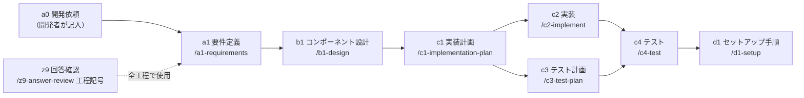
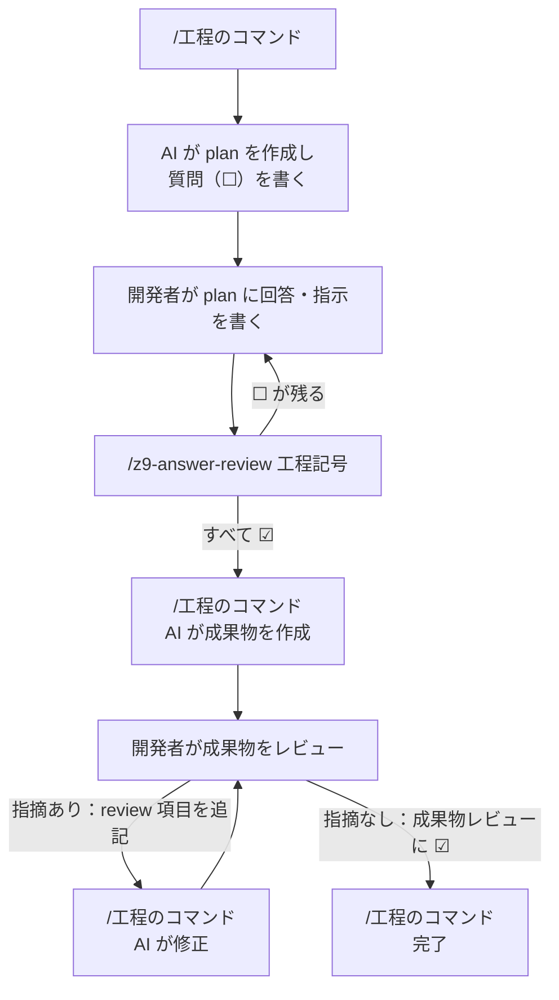

# AI 駆動開発 基盤ガイド

本フォルダは、このリポジトリの AI 駆動開発の基盤（`CLAUDE.md`、`.claude/skills/`、`templates/` 等）の使い方を、開発者向けに説明するものです。
AI は本フォルダを工程の根拠資料として使いません。

## 目次

| ファイル | 内容 |
|---|---|
| [01_setup.md](01_setup.md) | 利用開始の手順（基盤の取り込み、依頼書の作成、フックの有効化、動作確認） |
| [02_workflow.md](02_workflow.md) | 使い方（工程ごとのコマンドの流れ、回答・指示・レビュー指摘の書き方） |
| [03_notes.md](03_notes.md) | 注意点（書き換えてはいけない欄、コミット、秘密情報、引き継ぎ、困ったとき） |
| [04_sandbox.md](04_sandbox.md) | 安全な実行環境（Claude Code のサンドボックス、Dev Container） |

## 全体像

### 基本の考え方

- AI は主観で判断しません。資料に書かれていないことは、推測せずに plan ファイルへ質問（☐）として書きます。
- 決めるのは開発者です。AI は選択肢と、根拠のある推奨を示します。
- すべての工程は「plan → 成果物 → レビュー」の順で進みます。やり取りはすべてファイルに残ります。

### 工程の流れ

### 1 つの工程の進み方

### フォルダ構成

| フォルダ・ファイル | 内容 | 書く人 |
|---|---|---|
| `CLAUDE.md` | 全工程共通のルール | 基盤の管理者 |
| `.claude/skills/` | 工程ごとのコマンド（スキル） | 基盤の管理者 |
| `.claude/hooks/`、`.claude/settings.json` | やり取りの自動記録、サンドボックスの設定 | 基盤の管理者 |
| `.devcontainer/` | Dev Container のひな形 | 基盤の管理者（言語・ツールは c1 の決定に合わせて追加） |
| `templates/` | plan・成果物のひな形 | 基盤の管理者 |
| `guide/` | 本ガイド | 基盤の管理者 |
| `docs/a0_request/request.md` | 開発依頼書 | 開発者 |
| `docs/_reference/` | 参考資料 | 開発者 |
| `plans/` | 工程ごとの plan（質問・回答・進捗）、進捗一覧 `README.md` | AI と開発者 |
| `plans/_log/prompt-log.md` | やり取りの自動記録 | フック |
| `docs/a1_requirements/` 〜 `docs/d1_setup/` | 工程ごとの成果物 | AI |
| `src/`、`tests/` | コードとテスト | AI |
