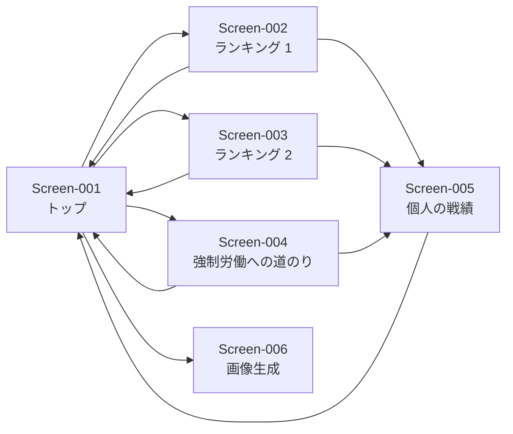

# コンポーネント設計 plan（b1）

<!--
ステータスの移り変わり（CLAUDE.md「5. 工程の進め方」）：
- 回答待ち：plan を作成した直後。「8. 質問・指示」に ☐ が残っている
- 確定：「8. 質問・指示」がすべて ☑ になった（/z9-answer-review で確認後）。計画が固まり、成果物を作成できる
- レビュー待ち：成果物を作成した。開発者のレビューを待っている
- 完了：開発者が「1. 進捗」の「6. 成果物レビュー」に ☑ を付け、「9. レビュー指摘」がすべて ☑ になった
- 差し戻し：他の工程から「8. 質問・指示」に質問が追加された
-->

| 項目 | 内容 |
|---|---|
| ステータス | 確定 |
| スキル | `/b1-design` |
| 成果物 | `docs/b1_design/component-design.md`、`docs/b1_design/decisions/`、`docs/b1_design/mockups/` |
| 最終更新 | 2026-09-26 18:49 |

## 1. 進捗

<!--
AI が段階を終えるたびに ☑ と日時を記載する。
「6. 成果物レビュー」は開発者のみが ☑ を付ける。成果物を変更した場合、AI が ☑ を外して再レビューを依頼する。
「回答待ち」「差し戻し」に戻った場合、AI が「2.」〜「5.」の ☑ を外す。
-->

- [x] 1. plan 作成（AI：`/b1-design`）2026-09-26 18:29
- [x] 2. 質問への回答・指示の記入（開発者）2026-09-26 18:49
- [x] 3. 回答の確認（AI：`/z9-answer-review b1`）2026-09-26 18:49
- [ ] 4. plan 確定（AI：`/b1-design`）
- [ ] 5. 成果物作成（AI：`/b1-design`）
- [ ] 6. 成果物レビュー（開発者）

## 2. 目的

要件定義書（`docs/a1_requirements/requirements.md`）の要件を満たす構成（コンポーネント、画面、データ、アクセス制御）を設計する。方式・技術の選択は選択肢と推奨を示して開発者が決め、決定を設計判断の記録（ADR）に残す。画面は HTML のモックで開発者の確認を得る。

## 3. 入力資料

| 資料 | 参照箇所 | 用途 |
|---|---|---|
| `docs/a1_requirements/requirements.md` | 全体（Feature-001〜013、Quality-001〜009、Constraint-001〜005、主要なデータ） | 設計の根拠 |
| `docs/a0_request/request.md` | 全体 | 要件の由来の確認 |
| `docs/_reference/` | ― | 格納された資料なし（2026-09-26 18:29 時点） |

## 4. 対象範囲

### 対象

| 要件 | 設計の観点 |
|---|---|
| Feature-001、Feature-002、Feature-011 | 入力用スプレッドシートの構成（シート、列、設定値、入力の誤り対策） |
| Feature-003〜Feature-007 | 収支・ランキングの計算（ロジック）と集計のタイミング |
| Feature-008〜Feature-010、Feature-012、Feature-013 | 画面（Web アプリ）の構成と画面モック |
| Quality-001〜Quality-003、Constraint-003、Constraint-004 | アクセス制御の方式 |
| Quality-004、Quality-005 | 画面の見た目の基準、スマートフォン対応 |
| Quality-006〜Quality-009 | データ量、保存、プライバシー、デプロイ |
| Constraint-001、Constraint-002、Constraint-005 | 技術（Google スプレッドシート、GAS）、無料、期間 |

### 対象外

| 内容 | 根拠 |
|---|---|
| 要件定義書「3. 対象範囲（対象外）」の事項（プレイヤーの登録画面、通知、コメント、ゲームの進行補助、専用の入力画面、バックアップ、独自の変更履歴） | `requirements.md` 3. 対象範囲 |
| 技術の選定のうち、データベース・実行環境（Google スプレッドシート・GAS で指定済み） | Constraint-001 |

## 5. 作業手順と実行結果

<!-- 本工程は実行を伴わないため「実行結果」は記載しない。 -->

- [x] 5-1. 要件の一覧化
  - 作業内容：Feature・Quality・Constraint・主要なデータを一覧化し、設計の対象範囲を整理する
  - 参照元：`requirements.md`
  - 作成・更新先：本 plan「4. 対象範囲」「6. 成果物の構成予定」
- [x] 5-2. 確認観点ごとの記載確認
  - 作業内容：確認観点（対象範囲、目標と非目標、全体構成、コンポーネント、データ設計、外部インターフェース、横断的な関心事、テストのしやすさ、画面）ごとに記載有無を確認し、Question 項目にする
  - 参照元：入力すべて
  - 作成・更新先：本 plan「8. 質問・指示」
- [x] 5-3. 設計判断が必要な事項の洗い出し
  - 作業内容：方式・技術の選択が必要な事項を洗い出し、選択肢を比較して Question 項目にする
  - 参照元：入力すべて
  - 作成・更新先：本 plan「8. 質問・指示」
- [x] 5-4. 画面の整理
  - 作業内容：画面の一覧と画面遷移を整理し、見た目の基準と画面ごとの案の数を Question 項目にする
  - 参照元：`requirements.md`（Feature、利用者、主要なデータ）
  - 作成・更新先：本 plan「6. 成果物の構成予定」「8. 質問・指示」
- [ ] 5-5. 画面モックの作成
  - 作業内容：確定した見た目の基準と案の数に従って HTML のモックを作成し、採用案・修正点を Question 項目にする
  - 参照元：本 plan の確定した回答・指示
  - 作成・更新先：`plans/b1_mockups/`、本 plan「8. 質問・指示」
- [ ] 5-6. 概要・目標と非目標・全体構成の作成
  - 作業内容：背景と対象範囲、目標と非目標、全体構成図（Mermaid）を記載する
  - 参照元：`requirements.md`、本 plan の確定した回答・指示
  - 作成・更新先：`component-design.md`（1〜3 節）
- [ ] 5-7. Component の作成
  - 作業内容：コンポーネントごとに責務・インターフェース・依存関係・対応する要件・関連する Decision を記載する
  - 参照元：`requirements.md`、本 plan の確定した回答・指示
  - 作成・更新先：`component-design.md`（`Component-XXX`）
- [ ] 5-8. 画面設計の作成
  - 作業内容：採用したモックを成果物に配置し、画面一覧・画面遷移図・画面ごとの項目を記載する
  - 参照元：`plans/b1_mockups/`、本 plan の確定した回答・指示
  - 作成・更新先：`docs/b1_design/mockups/`、`component-design.md`（8 節）
- [ ] 5-9. データ設計・外部インターフェースの作成
  - 作業内容：主要なデータの保存先・形式・機密性への対策、外部との連携を記載する
  - 参照元：`requirements.md`（6. 主要なデータ）、本 plan の確定した回答・指示
  - 作成・更新先：`component-design.md`（5〜6 節）
- [ ] 5-10. 横断的な関心事の作成
  - 作業内容：STRIDE による脅威分析、プライバシー、ログ・監視、エラー処理、テストのしやすさを記載する
  - 参照元：`requirements.md`（Quality）、本 plan の確定した回答・指示
  - 作成・更新先：`component-design.md`（7 節）
- [ ] 5-11. Decision の作成
  - 作業内容：設計判断に関する Question 項目ごとに設計判断の記録を作成する
  - 参照元：本 plan の設計判断に関する Question 項目と回答
  - 作成・更新先：`decisions/Decision-XXXX-<題名>.md`、`component-design.md`（9 節）
- [ ] 5-12. トレーサビリティの確認
  - 作業内容：すべての Feature・Quality・Constraint がいずれかの Component・Screen・設計事項に対応していることを確認する
  - 参照元：`requirements.md`、`component-design.md`
  - 作成・更新先：`component-design.md`（10 節）

## 6. 成果物の構成予定

<!-- 回答により追加・変更・削除する。 -->

### コンポーネント（案）

| 項目 | 内容 | 由来 |
|---|---|---|
| Component（入力用スプレッドシート） | プレイ結果・設定値（1 つ。変更すると過去も再計算）の入力、修正・削除。管理者・開発者のみ閲覧・編集。入力規則（日付・数値の形式）と、ニックネームの候補表示を設ける | Feature-001、Feature-002、Feature-011、Quality-002、Question-006、Question-007 |
| Component（集計の実行） | 管理者がスプレッドシートのメニューから「集計を反映」を実行すると、集計結果を閲覧用スプレッドシートに書き出す。不完全な行は集計から除外し、該当行に印を付ける | Feature-001、Question-002、Question-008 |
| Component（集計ロジック） | 収支、ランキング 1・2、基準値、順位付け、集計期間の計算。ニックネームの前後の空白を取り除く。スプレッドシート等に依存しない純粋な計算として分離する | Feature-003〜Feature-007、Question-007、テストのしやすさ（確認観点 8） |
| Component（データアクセス） | 入力用・閲覧用スプレッドシートの読み書き。集計ロジックから分離する | Feature-001、Feature-002、Question-001、テストのしやすさ（確認観点 8） |
| Component（閲覧用スプレッドシート） | 集計結果（ニックネーム、ランキングの値、実施日ごとの履歴）のみを保持する。閲覧者に閲覧権限で共有する（＝招待） | Quality-001、Quality-003、Question-001 |
| Component（Web アプリ：サーバー側） | 「アクセスしたユーザーとして実行」＋「Google アカウントを持つ全員」で公開し、閲覧用スプレッドシートからデータを読み込んで画面に渡す。共有されていないアカウントではデータを読めない | Feature-008〜Feature-010、Quality-001、Question-001 |
| Component（Web アプリ：画面） | トップ、ランキング、個人の戦績、画像生成、免責表示。HTML・CSS・JavaScript のみで作る（外部ライブラリなし） | Feature-008〜Feature-010、Feature-012、Feature-013、Quality-005、Question-003 |
| Component（画像生成） | ブラウザの描画機能（canvas）で 9:16 の画像を作り、画面に表示する。利用者が長押しで保存・共有する | Feature-012、Question-004 |

- プログラミング言語は JavaScript とする（Question-005）。
- エラーの記録は GAS の標準の実行ログのみとする（Question-009）。
- 画面の雰囲気は、ポーカー・カジノを題材にしたテーマとする（Question-010）。
- 文字と背景の明暗の差は WCAG 2.1 AA の基準（通常の文字で 4.5:1 以上）に合わせる（Question-010-1）。

### 画面（案）

| Screen | 名称 | 利用者 | 対応する Feature | 由来 |
|---|---|---|---|---|
| Screen-001 | トップ画面 | 閲覧者・管理者・開発者 | Feature-007、Feature-008、Feature-013 | Request-3-2 |
| Screen-002 | ランキング画面：回数が少なくても活躍できる（ランキング 1） | 同上 | Feature-004、Feature-007、Feature-009、Feature-013 | Request-3-2 |
| Screen-003 | ランキング画面：回数の多い人向け（ランキング 2） | 同上 | Feature-005、Feature-007、Feature-009、Feature-013 | Request-3-2 |
| Screen-004 | ランキング画面：強制労働への道のり | 同上 | Feature-006、Feature-007、Feature-009、Feature-013 | Request-3-2 |
| Screen-005 | 個人の戦績画面 | 同上 | Feature-010、Feature-013 | Request-3-2 |
| Screen-006 | 画像生成画面（ランキングの画像の表示・保存） | 同上 | Feature-012、Feature-013 | Request-3-3 |

- 結果入力画面は専用画面を作らず、スプレッドシートへ直接入力する（requirements.md 3. 対象外、a1/Question-008）。
- Screen-002〜004 は表示する値のみが異なり、同じ配置（レイアウト）を使う想定。

### 画面遷移（案）

### 設計判断の記録（予定）

| Decision | 題名 | 由来 |
|---|---|---|
| Decision-0001 | 閲覧のアクセス制御の方式 | Question-001 |
| Decision-0002 | 集計のタイミング | Question-002 |
| Decision-0003 | 画面の実装方式 | Question-003 |
| Decision-0004 | 画像生成の方式 | Question-004 |
| Decision-0005 | プログラミング言語 | Question-005 |
| Decision-0006 | 設定値の持ち方 | Question-006 |

## 7. 他工程との関係

| 日時 | 種別 | 相手工程 | 項目 | 内容 |
|---|---|---|---|---|

## 8. 質問・指示

### AI からの質問

<!-- AI が記載する。開発者は「開発者回答：」に回答を記入する。 -->

#### 設計判断（方式・技術）

- [x] **Question-001**：閲覧のアクセス制御の方式を選んでください。
  - 根拠：Quality-001 で「招待したアカウントのみ閲覧できる」、Quality-002 で「入力用スプレッドシートは管理者・開発者のみ」、Quality-003 で「招待は開発者が行う」としているが、実現方式の記載がない。GAS の Web アプリの公開設定は「実行するユーザー（自分／アクセスしたユーザー）」と「アクセスできるユーザー（自分のみ／Google アカウントを持つ全員／全員）」の組み合わせであり、個人の Google アカウント（Google Workspace ではない）では「特定のアカウントのみ」を公開設定だけで指定することはできない。また、「自分として実行」する場合、閲覧者のメールアドレスをスクリプトから取得できないため、許可リストで照合する方式は使えない。
  - 選択肢：
    - (a) 「アクセスしたユーザーとして実行」＋「Google アカウントを持つ全員」。閲覧用のデータ（集計結果・ニックネーム・履歴のみ）を入力用とは別の「閲覧用スプレッドシート」に書き出し、閲覧者にはそのスプレッドシートを閲覧権限で共有する（＝招待）。共有されていないアカウントはデータを読めず、画面にデータが表示されない
      - 良い点：Google のファイル共有でアクセスを制御でき、招待・削除を開発者が行える（Quality-001、Quality-003）。入力用スプレッドシートは閲覧者に共有しない（Quality-002）。無料（Constraint-002）
      - 悪い点：閲覧者は初回アクセス時にスクリプトの利用を許可する操作が必要（未確認のアプリである旨の警告が表示される）。閲覧者は閲覧用スプレッドシートを直接開くこともできる（入力用のデータではなく、集計結果のみ）。集計結果の書き出しが必要（Question-002）
    - (b) 「自分として実行」＋「Google アカウントを持つ全員」。URL を知っている人のみに共有する
      - 良い点：構成が最も簡単。閲覧者の許可操作が不要
      - 悪い点：URL が共有されると、招待していない Google アカウントでも閲覧できる。Quality-001（招待したアカウントのみ）、Request-4-1（アクセス権限を厳密に）を満たさない
    - (c) その他（記載）
  - 推奨：(a)。Quality-001〜003 と Constraint-002 をすべて満たす選択肢であるため。(b) は Quality-001 を満たさない。
  - 開発者回答：(a)

  - AI確認結果：(a)「アクセスしたユーザーとして実行」＋「Google アカウントを持つ全員」、閲覧用スプレッドシートを閲覧者に共有する方式で確認した。Quality-001〜003、Constraint-002〜004 と矛盾しない。Decision-0001 として記録する。本 plan「6. 成果物の構成予定」に反映した。（2026-09-26 18:44）

- [x] **Question-002**：集計のタイミングを選んでください。また、入力してからランキングに反映されるまでに許容できる時間を教えてください。
  - 根拠：Feature-001「入力した行がランキングの集計対象になる」とあるが、反映までの時間の記載がない。Question-001 で (a) を選ぶ場合、集計結果を閲覧用スプレッドシートへ書き出す処理が必要になる。
  - 選択肢：
    - (a) 管理者がスプレッドシートのメニューから「集計を反映」を実行したときに書き出す
      - 良い点：入力が終わったタイミングで確実に反映でき、入力途中の値が表示されない
      - 悪い点：管理者が実行を忘れると反映されない
    - (b) 一定時間ごと（例：1 時間ごと）に自動で書き出す
      - 良い点：操作が不要
      - 悪い点：反映まで最大で設定した時間がかかる。入力途中の値が表示されることがある
    - (c) (a) と (b) の両方
    - (d) 閲覧のたびに入力用スプレッドシートから集計する（Question-001 で (b) を選ぶ場合のみ可能）
  - 推奨：(c)。Feature-001 の反映を確実にしつつ、実行忘れも補えるため。反映までの許容時間は推奨なし（根拠資料なし）。
  - 開発者回答：(a)

  - AI確認結果：(a) 管理者がスプレッドシートのメニューから「集計を反映」を実行したときに書き出す方式で確認した。反映のタイミングは管理者の操作で決まるため、反映までの許容時間の回答は不要と判断した（自動の書き出しは行わない）。Question-001 (a) と矛盾しない。Decision-0002 として記録する。本 plan「6. 成果物の構成予定」に反映した。（2026-09-26 18:44）

- [x] **Question-003**：画面の実装方式を選んでください。
  - 根拠：Feature-008〜Feature-010、Feature-012 の画面を GAS の Web アプリ（HtmlService）で作る（Constraint-001）が、画面の作り方の記載がない。
  - 選択肢：
    - (a) HTML・CSS・JavaScript のみで作る（外部のライブラリを使わない）
      - 良い点：外部への依存がなく、脆弱性の管理対象が少ない（Microsoft SDL：外部コンポーネントの管理）。動作が軽い
      - 悪い点：画面の部品を自作する必要がある
    - (b) 軽量なライブラリ（例：Alpine.js、Vue.js）を CDN から読み込んで作る
      - 良い点：画面の更新処理を簡潔に書ける
      - 悪い点：外部への依存と脆弱性の管理対象が増える
  - 推奨：(a)。画面数が 6 と少なく（本 plan「6. 画面（案）」）、Microsoft SDL の外部コンポーネントの管理の観点で依存を増やさないほうがよいため。
  - 開発者回答：(a)

  - AI確認結果：(a) HTML・CSS・JavaScript のみ（外部ライブラリなし）で確認した。Constraint-001 と矛盾しない。Decision-0003 として記録する。（2026-09-26 18:44）

- [x] **Question-004**：画像生成の方式を選んでください。
  - 根拠：Feature-012 で「9:16 の画像を画面上に表示し、利用者が端末に保存・共有する」とあるが、画像の作り方の記載がない。
  - 選択肢：
    - (a) 画面（ブラウザ）上で描画機能（canvas）を使って画像を作り、表示する。利用者は画像を長押しして保存・共有する
      - 良い点：サーバー側の処理や追加のサービスが不要で無料（Constraint-002）。スマートフォンで保存しやすい（Quality-005）
      - 悪い点：画像の描画処理を自作する必要がある
    - (b) Google スライドにランキングを書き込み、画像として書き出す
      - 良い点：スライド上で見た目を調整しやすい
      - 悪い点：処理が重く、スライドのファイル管理と権限の設定が増える
  - 推奨：(a)。Constraint-002（無料）と Quality-005（スマートフォン）に合い、Question-001 のアクセス制御に追加のファイルを増やさないため。
  - 開発者回答：(a)

  - AI確認結果：(a) ブラウザ上の描画機能（canvas）で画像を作り、利用者が長押しで保存・共有する方式で確認した。Feature-012、Question-003 (a)（外部ライブラリなし）と矛盾しない。Decision-0004 として記録する。（2026-09-26 18:44）

- [x] **Question-005**：プログラミング言語を選んでください。
  - 根拠：Constraint-001 で GAS を採用するが、GAS で動かすコードを JavaScript で直接書くか、TypeScript で書いて変換するかの記載がない。
  - 選択肢：
    - (a) JavaScript
      - 良い点：変換が不要で、GAS のエディタでもそのまま読める
      - 悪い点：型の誤りを実行前に見つけにくい
    - (b) TypeScript（手元で JavaScript に変換して GAS に送る）
      - 良い点：型の誤りを実行前に見つけられる
      - 悪い点：変換の仕組み（c1 で決める開発の前提）が必要
  - 推奨：推奨なし（根拠資料なし）。
  - 開発者回答：(a)

  - AI確認結果：(a) JavaScript で確認した。Constraint-001 と矛盾しない。Decision-0005 として記録する。（2026-09-26 18:44）

- [x] **Question-006**：設定値（配布チップ数、強制労働の基準の回数 N）を変更したとき、過去の実施日の計算に影響させますか。
  - 根拠：Feature-002 で設定値を入力できるとしているが、年の途中で設定値を変更した場合に、過去の実施日の収支・基準値を変更後の値で計算し直すかの記載がない。
  - 選択肢：
    - (a) 設定値は 1 つとし、変更すると過去の実施日も変更後の値で計算し直す
      - 良い点：入力項目が増えない
      - 悪い点：変更前の実施日の収支も変わる
    - (b) 配布チップ数を実施日ごとに記録する（入力の行に「配布チップ数」の列を追加し、未入力なら設定値を使う）
      - 良い点：変更前の実施日の収支が変わらない
      - 悪い点：入力の列が 1 つ増える。Feature-001 の入力項目が変わるため、a1（要件定義）の差し戻しが必要になる
  - 推奨：推奨なし（根拠資料なし）。設定値を変更する予定があるかどうかで選んでください。
  - 開発者回答：(a)

  - AI確認結果：(a) 設定値は 1 つとし、変更すると過去の実施日も変更後の値で計算し直す方式で確認した。Feature-001・Feature-002 の入力項目は変わらないため、a1 の差し戻しは不要。Decision-0006 として記録する。（2026-09-26 18:44）

#### データ・横断的な関心事

- [x] **Question-007**：入力の誤りへの対策をどこまで行いますか。
  - 根拠：Feature-001 条件4 で「新しいプレイヤー名で行を入力すると、登録操作なしに集計対象になる」としているため、ニックネームの入力誤り（例：全角・半角の違い、打ち間違い）は別のプレイヤーとして集計される。入力誤りへの対策の記載がない。
  - 選択肢（複数選択可）：
    - (a) スプレッドシートの入力規則で、日付・数値（プレイ時間、最終チップ数、借金回数）の形式を制限する
    - (b) ニックネームの列に、既存のニックネームを候補として表示する（新しい名前も入力できる）
    - (c) 集計時に、ニックネームの前後の空白を取り除く
    - (d) 対策しない
  - 推奨：(a)(b)(c)。Feature-001 の「手早く入力できる」と、プレイヤーの登録画面を作らない（requirements.md 3. 対象外）こととの両立のため。
  - 開発者回答：(a)(b)(c)

  - AI確認結果：(a) 日付・数値の入力規則、(b) 既存のニックネームを候補として表示、(c) 集計時にニックネームの前後の空白を取り除く、の 3 つで確認した。Feature-001（新しい名前も入力できる）と矛盾しない。本 plan「6. 成果物の構成予定」に反映した。（2026-09-26 18:44）

- [x] **Question-008**：必須の項目が空欄の行や、形式が誤っている行を、集計でどう扱いますか。
  - 根拠：Feature-001 に入力項目の記載はあるが、不完全な行の扱いの記載がない。
  - 選択肢：
    - (a) 集計から除外し、スプレッドシート上で該当する行に印（色付け等）を付けて管理者に知らせる
    - (b) 集計から除外するのみ
    - (c) 集計を止め、管理者に知らせる
  - 推奨：(a)。入力誤りに管理者が気づけ、他の正しい行の集計は止まらないため。
  - 開発者回答：(a)

  - AI確認結果：(a) 集計から除外し、スプレッドシート上で該当する行に印を付けて管理者に知らせる方式で確認した。Question-002 (a)（管理者がメニューから集計を反映）と合わせ、集計の実行時に印を付ける。本 plan「6. 成果物の構成予定」に反映した。（2026-09-26 18:44）

- [x] **Question-009**：エラーの記録（ログ）は、GAS の標準の実行ログで足りますか。
  - 根拠：Quality-007 で入力・修正の履歴は Google スプレッドシートの版の履歴で代替するとしているが、アプリケーションのエラーの記録・監視の記載がない（Microsoft SDL：ログ・監査）。
  - 選択肢：(a) GAS の標準の実行ログのみ（開発者が必要なときに確認する） (b) エラー時に開発者へメールで通知する (c) エラーをスプレッドシートにも記録する
  - 推奨：(a)。Quality-007 で独自の記録を対象外としており、規模（Quality-006）に対して追加の仕組みを要しないため。
  - 開発者回答：(a)

  - AI確認結果：(a) GAS の標準の実行ログのみで確認した。Quality-007 と矛盾しない。設計書「7. 横断的な関心事（ログ・監視）」に記載する。（2026-09-26 18:44）

#### 画面

- [x] **Question-010**：画面の見た目の基準を教えてください。
  - 根拠：Feature-008「わくわくするトップ画面」、Quality-004「楽しめ、嫌な気持ちにならない表示」、Quality-005「スマートフォンを前提」とあるが、見た目の基準（色、雰囲気、デザインシステム、アクセシビリティ）の記載がない。
  - 選択肢（例示）：
    - 雰囲気：(a) ポーカー・カジノを題材にしたテーマ（例：テーブルの緑、チップ、トランプの意匠） (b) 既存のデザインシステム（例：Material Design 3）に沿った落ち着いたデザイン (c) 参考にしたいサイト・画像がある（`docs/_reference/` に格納） (d) 指定なし（AI の案を見て決める）
    - アクセシビリティ：(e) 文字と背景の明暗の差（コントラスト）を WCAG 2.1 AA の基準に合わせる (f) 指定なし
  - 推奨：雰囲気は (a)。Request-1-1（テキサスホールデムポーカー）と Feature-008（わくわくする）に合うため。アクセシビリティは推奨なし（根拠資料なし）。
  - 開発者回答：(a)

  - AI確認結果：雰囲気は (a) ポーカー・カジノを題材にしたテーマで確認した。一方、アクセシビリティ（(e) WCAG 2.1 AA／(f) 指定なし）の回答がないため、Question-010-1 で確認する。

  - [x] **Question-010-1**：アクセシビリティ（文字と背景の明暗の差）の基準を教えてください。
    - 根拠：Question-010 の回答は雰囲気 (a) のみで、アクセシビリティの選択肢（(e)／(f)）の回答がない。ポーカー・カジノのテーマ（例：濃い緑の背景）では、文字の読みやすさに影響する。
    - 選択肢：(a) 文字と背景の明暗の差を WCAG 2.1 AA の基準（通常の文字で 4.5:1 以上）に合わせる (b) 指定なし
    - 推奨：推奨なし（根拠資料なし）。Quality-005（スマートフォンを前提）では屋外など明るい場所で見ることもあるため、(a) を選ぶと読みやすさを確保しやすい。
    - 開発者回答：(a)

    - AI確認結果：文字と背景の明暗の差を WCAG 2.1 AA の基準（通常の文字で 4.5:1 以上）に合わせることを確認した。Question-010 (a)（ポーカー・カジノのテーマ）と両立させて画面モックを作成する。Question-010 もあわせて ☑ とした。本 plan「6. 成果物の構成予定」に反映した。（2026-09-26 18:49）

- [x] **Question-011**：画面ごとに作るモックの案の数を教えてください。
  - 根拠：画面モックで採用する案を選ぶため、作成前に案の数を確定させる（b1 のスキルの定め）。
  - 選択肢：
    - (a) 推奨どおり：Screen-001（トップ）2 案、Screen-002〜004（ランキング画面・共通の配置）2 案、Screen-005（個人の戦績）1 案、Screen-006（画像生成）1 案
    - (b) その他（画面ごとの案の数を記載）
  - 推奨：(a)。Screen-001 は利用者が最初に使う画面（Feature-008）であり、Screen-002〜004 は対応する Feature が最も多い（Feature-004〜007、Feature-009、Feature-013）ため、主要な画面として 2 案とする。
  - 開発者回答：(a)

  - AI確認結果：(a) Screen-001 を 2 案、Screen-002〜004（共通の配置）を 2 案、Screen-005 を 1 案、Screen-006 を 1 案で確認した。画面モックは、Question-010-1（アクセシビリティ）の回答後に作成する。（2026-09-26 18:44）

### 開発者からの質問・指示

<!--
開発者が追記する。記入例：
- [ ] **dev-001**：<質問・指示の内容>
  - AI対応内容：

  - AI確認結果：
ID を付けずに追記した場合は、AI が ID を付与する。
-->

## 9. レビュー指摘

<!--
成果物レビューで指摘がある場合、開発者が追記する。記入例：
- [ ] **review-001**：<指摘内容>
  - AI対応内容：

  - AI確認結果：
追記後に `/b1-design` を実行すると、AI が成果物を修正する。
指摘がない場合は「1. 進捗」の「6. 成果物レビュー」に ☑ を付け、`/b1-design` を実行する。
-->

## 10. 変更履歴

| 日時 | スキル | 変更内容 | 根拠 |
|---|---|---|---|
| 2026-09-26 18:29 | /b1-design | plan を作成し、Question-001〜011 を記載 | `docs/a1_requirements/requirements.md`（a1 完了） |
| 2026-09-26 18:46 | /z9-answer-review b1 | Question-001〜009、011 に ☑ を付与。Question-010 はアクセシビリティの回答がないため Question-010-1 を追記。「6. 成果物の構成予定」のコンポーネントに回答を反映 | 各 Question の開発者回答 |
| 2026-09-26 18:49 | /z9-answer-review b1 | Question-010-1 と Question-010 に ☑ を付与。「8. 質問・指示」がすべて ☑ となったため、ステータスを「確定」とし、「1. 進捗」の 2・3 に ☑ を付与。「6. 成果物の構成予定」に回答を反映 | b1/Question-010-1 の開発者回答 |
