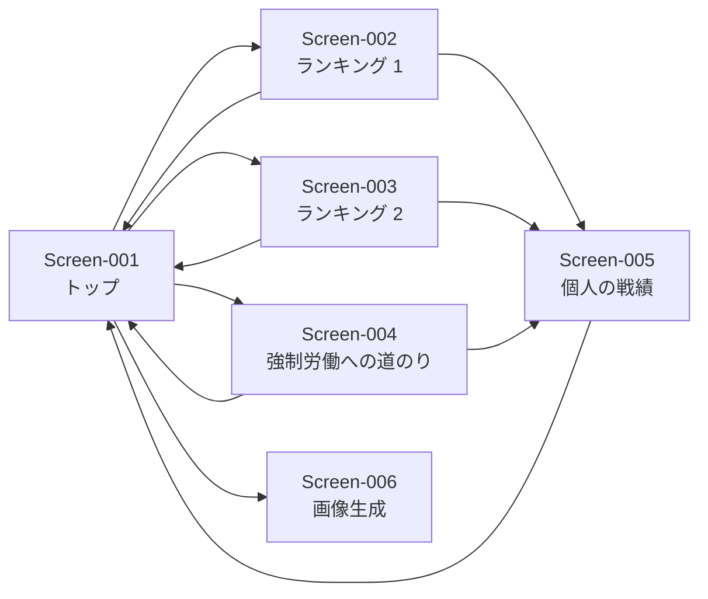

# コンポーネント設計 plan（b1）

<!--
ステータスの移り変わり（CLAUDE.md「5. 工程の進め方」）：
- 回答待ち：plan を作成した直後。「8. 質問・指示」に ☐ が残っている
- 確定：「8. 質問・指示」がすべて ☑ になった（/z9-answer-review で確認後）。計画が固まり、成果物を作成できる
- レビュー待ち：成果物を作成した。開発者のレビューを待っている
- 完了：開発者が「1. 進捗」の「6. 成果物レビュー」に ☑ を付け、「9. レビュー指摘」がすべて ☑ になった
- 差し戻し：他の工程から「8. 質問・指示」に質問が追加された
-->

| 項目 | 内容 |
|---|---|
| ステータス | 完了|
| スキル | `/b1-design` |
| 成果物 | `docs/b1_design/component-design.md`、`docs/b1_design/decisions/`、`docs/b1_design/mockups/` |
| 最終更新 | 2026-09-26 22:43 |

## 1. 進捗

<!--
AI が段階を終えるたびに ☑ と日時を記載する。
「6. 成果物レビュー」は開発者のみが ☑ を付ける。成果物を変更した場合、AI が ☑ を外して再レビューを依頼する。
「回答待ち」「差し戻し」に戻った場合、AI が「2.」〜「5.」の ☑ を外す。
-->

- [x] 1. plan 作成（AI：`/b1-design`）2026-09-26 18:29
- [x] 2. 質問への回答・指示の記入（開発者）2026-09-26 22:42
- [x] 3. 回答の確認（AI：`/z9-answer-review b1`）2026-09-26 22:42
- [x] 4. plan 確定（AI：`/b1-design`）2026-09-26 22:43
- [x] 5. 成果物作成（AI：`/b1-design`）2026-09-26 22:43
- [x] 6. 成果物レビュー（開発者）

## 2. 目的

要件定義書（`docs/a1_requirements/requirements.md`）の要件を満たす構成（コンポーネント、画面、データ、アクセス制御）を設計する。方式・技術の選択は選択肢と推奨を示して開発者が決め、決定を設計判断の記録（ADR）に残す。画面は HTML のモックで開発者の確認を得る。

## 3. 入力資料

| 資料 | 参照箇所 | 用途 |
|---|---|---|
| `docs/a1_requirements/requirements.md` | 全体（Feature-001〜013、Quality-001〜009、Constraint-001〜005、主要なデータ） | 設計の根拠 |
| `docs/a0_request/request.md` | 全体 | 要件の由来の確認 |
| `docs/_reference/` | ― | 格納された資料なし（2026-09-26 18:29 時点） |

## 4. 対象範囲

### 対象

| 要件 | 設計の観点 |
|---|---|
| Feature-001、Feature-002、Feature-011 | 入力用スプレッドシートの構成（シート、列、設定値、入力の誤り対策） |
| Feature-003〜Feature-007 | 収支・ランキングの計算（ロジック）と集計のタイミング |
| Feature-008〜Feature-010、Feature-012、Feature-013 | 画面（Web アプリ）の構成と画面モック |
| Quality-001〜Quality-003、Constraint-003、Constraint-004 | アクセス制御の方式 |
| Quality-004、Quality-005 | 画面の見た目の基準、スマートフォン対応 |
| Quality-006〜Quality-009 | データ量、保存、プライバシー、デプロイ |
| Constraint-001、Constraint-002、Constraint-005 | 技術（Google スプレッドシート、GAS）、無料、期間 |

### 対象外

| 内容 | 根拠 |
|---|---|
| 要件定義書「3. 対象範囲（対象外）」の事項（プレイヤーの登録画面、通知、コメント、ゲームの進行補助、専用の入力画面、バックアップ、独自の変更履歴） | `requirements.md` 3. 対象範囲 |
| 技術の選定のうち、データベース・実行環境（Google スプレッドシート・GAS で指定済み） | Constraint-001 |

## 5. 作業手順と実行結果

<!-- 本工程は実行を伴わないため「実行結果」は記載しない。 -->

- [x] 5-1. 要件の一覧化
  - 作業内容：Feature・Quality・Constraint・主要なデータを一覧化し、設計の対象範囲を整理する
  - 参照元：`requirements.md`
  - 作成・更新先：本 plan「4. 対象範囲」「6. 成果物の構成予定」
- [x] 5-2. 確認観点ごとの記載確認
  - 作業内容：確認観点（対象範囲、目標と非目標、全体構成、コンポーネント、データ設計、外部インターフェース、横断的な関心事、テストのしやすさ、画面）ごとに記載有無を確認し、Question 項目にする
  - 参照元：入力すべて
  - 作成・更新先：本 plan「8. 質問・指示」
- [x] 5-3. 設計判断が必要な事項の洗い出し
  - 作業内容：方式・技術の選択が必要な事項を洗い出し、選択肢を比較して Question 項目にする
  - 参照元：入力すべて
  - 作成・更新先：本 plan「8. 質問・指示」
- [x] 5-4. 画面の整理
  - 作業内容：画面の一覧と画面遷移を整理し、見た目の基準と画面ごとの案の数を Question 項目にする
  - 参照元：`requirements.md`（Feature、利用者、主要なデータ）
  - 作成・更新先：本 plan「6. 成果物の構成予定」「8. 質問・指示」
- [x] 5-5. 画面モックの作成
  - 作業内容：確定した見た目の基準と案の数に従って HTML のモックを作成し、採用案・修正点を Question 項目にする
  - 参照元：本 plan の確定した回答・指示
  - 作成・更新先：`plans/b1_mockups/`、本 plan「8. 質問・指示」
- [x] 5-6. 概要・目標と非目標・全体構成の作成
  - 作業内容：背景と対象範囲、目標と非目標、全体構成図（Mermaid）を記載する
  - 参照元：`requirements.md`、本 plan の確定した回答・指示
  - 作成・更新先：`component-design.md`（1〜3 節）
- [x] 5-7. Component の作成
  - 作業内容：コンポーネントごとに責務・インターフェース・依存関係・対応する要件・関連する Decision を記載する
  - 参照元：`requirements.md`、本 plan の確定した回答・指示
  - 作成・更新先：`component-design.md`（`Component-XXX`）
- [x] 5-8. 画面設計の作成
  - 作業内容：採用したモックを成果物に配置し、画面一覧・画面遷移図・画面ごとの項目を記載する
  - 参照元：`plans/b1_mockups/`、本 plan の確定した回答・指示
  - 作成・更新先：`docs/b1_design/mockups/`、`component-design.md`（8 節）
- [x] 5-9. データ設計・外部インターフェースの作成
  - 作業内容：主要なデータの保存先・形式・機密性への対策、外部との連携を記載する
  - 参照元：`requirements.md`（6. 主要なデータ）、本 plan の確定した回答・指示
  - 作成・更新先：`component-design.md`（5〜6 節）
- [x] 5-10. 横断的な関心事の作成
  - 作業内容：STRIDE による脅威分析、プライバシー、ログ・監視、エラー処理、テストのしやすさを記載する
  - 参照元：`requirements.md`（Quality）、本 plan の確定した回答・指示
  - 作成・更新先：`component-design.md`（7 節）
- [x] 5-11. Decision の作成
  - 作業内容：設計判断に関する Question 項目ごとに設計判断の記録を作成する
  - 参照元：本 plan の設計判断に関する Question 項目と回答
  - 作成・更新先：`decisions/Decision-XXXX-<題名>.md`、`component-design.md`（9 節）
- [x] 5-12. トレーサビリティの確認
  - 作業内容：すべての Feature・Quality・Constraint がいずれかの Component・Screen・設計事項に対応していることを確認する
  - 参照元：`requirements.md`、`component-design.md`
  - 作成・更新先：`component-design.md`（10 節）

## 6. 成果物の構成予定

<!-- 回答により追加・変更・削除する。 -->

### コンポーネント（案）

| 項目 | 内容 | 由来 |
|---|---|---|
| Component（入力用スプレッドシート） | プレイ結果・設定値（1 つ。変更すると過去も再計算）の入力、修正・削除。管理者・開発者のみ閲覧・編集。入力規則（日付・数値の形式）と、ニックネームの候補表示を設ける | Feature-001、Feature-002、Feature-011、Quality-002、Question-006、Question-007 |
| Component（集計の実行） | 管理者がスプレッドシートのメニューから「集計を反映」を実行すると、集計結果を閲覧用スプレッドシートに書き出す。不完全な行は集計から除外し、該当行に印を付ける。設定値（配布チップ数・N）のどちらかが空欄・誤った形式なら集計を中止し、管理者にメッセージで知らせる（閲覧用スプレッドシートは更新しない） | Feature-001、Question-002、Question-008、Question-019 |
| Component（集計ロジック） | 収支、ランキング 1・2、基準値、順位付け、集計期間の計算。ニックネームの前後の空白を取り除く。行の確認では、空欄・形式に加えて、プレイ時間・最終チップ数・借金回数が 0 以上（小数・0 も有効、上限なし）であることを確認し、満たさない行は除外して印を付ける。スプレッドシート等に依存しない純粋な計算として分離する | Feature-003〜Feature-007、Question-007、Question-008、Question-020、テストのしやすさ（確認観点 8） |
| Component（データアクセス） | 入力用・閲覧用スプレッドシートの読み書き。集計ロジックから分離する | Feature-001、Feature-002、Question-001、テストのしやすさ（確認観点 8） |
| Component（閲覧用スプレッドシート） | 集計結果（ニックネーム、ランキングの値、実施日ごとの履歴）のみを保持する。閲覧者に閲覧権限で共有する（＝招待） | Quality-001、Quality-003、Question-001 |
| Component（Web アプリ：サーバー側） | 「アクセスしたユーザーとして実行」＋「Google アカウントを持つ全員」で公開し、閲覧用スプレッドシートからデータを読み込んで画面に渡す。共有されていないアカウントではデータを読めない | Feature-008〜Feature-010、Quality-001、Question-001 |
| Component（Web アプリ：画面） | トップ、ランキング、個人の戦績、画像生成、免責表示。HTML・CSS・JavaScript のみで作る（外部ライブラリなし）。画面に表示する文字列（ニックネーム等）はすべて文字として表示し、HTML として解釈させない | Feature-008〜Feature-010、Feature-012、Feature-013、Quality-005、Question-003、Question-018 |
| Component（画像生成） | ブラウザの描画機能（canvas）で 9:16 の画像を作り、画面に表示する。利用者が長押しで保存・共有する | Feature-012、Question-004 |

- GAS のプロジェクトは 2 つに分ける。集計用（入力用スプレッドシートに付属。入力用スプレッドシートのメニュー、集計の実行、スプレッドシートの編集の権限）と、閲覧用の Web アプリ（単独のプロジェクト。スプレッドシートの読み取りのみの権限）。集計ロジックの共有の方法は c1 で決める（Question-017）。
- プログラミング言語は JavaScript とする（Question-005）。
- エラーの記録は GAS の標準の実行ログのみとする（Question-009）。
- 画面の雰囲気は、ポーカー・カジノを題材にしたテーマとする（Question-010）。
- 文字と背景の明暗の差は WCAG 2.1 AA の基準（通常の文字で 4.5:1 以上）に合わせる（Question-010-1）。

### 画面（案）

| Screen | 名称 | 利用者 | 対応する Feature | 由来 |
|---|---|---|---|---|
| Screen-001 | トップ画面 | 閲覧者・管理者・開発者 | Feature-007、Feature-008、Feature-013 | Request-3-2 |
| Screen-002 | ランキング画面：アベレージランキング（ランキング 1） | 同上 | Feature-004、Feature-007、Feature-009、Feature-013 | Request-3-2 |
| Screen-003 | ランキング画面：累計ランキング（ランキング 2） | 同上 | Feature-005、Feature-007、Feature-009、Feature-013 | Request-3-2 |
| Screen-004 | ランキング画面：強制労働への道のり | 同上 | Feature-006、Feature-007、Feature-009、Feature-013 | Request-3-2 |
| Screen-005 | 個人の戦績画面 | 同上 | Feature-010、Feature-013 | Request-3-2 |
| Screen-006 | 画像生成画面（ランキングの画像の表示・保存） | 同上 | Feature-012、Feature-013 | Request-3-3 |

- 結果入力画面は専用画面を作らず、スプレッドシートへ直接入力する（requirements.md 3. 対象外、a1/Question-008）。
- Screen-002〜004 は表示する値のみが異なり、同じ配置（レイアウト）を使う想定。
- Screen-001 は案 a（3 つのランキングをカードで縦に並べる）を採用する（Question-012）。
- Screen-002〜004 は案 a（一覧表形式）を採用する（Question-013）。
- ランキングの呼び名：ランキング 1 ＝アベレージランキング、ランキング 2 ＝累計ランキング、強制労働への道のり（Question-012-1）。
- アプリの名称：POKER RANKING（Question-015-1）。
- アベレージランキングの値の見出しは「平均値チップ数」とする。計算方法は Feature-004 のまま（Question-016、review-005）。
- 累計ランキングは、集計期間内の収支の合計（チップ数）が大きい順に表示し、見出しは「累計チップ数」とする（review-001、review-006、a1/Question-024）。
- 強制労働への道のりは、基準値がマイナスの人のみを表示し、対象者がいない場合は「ランキングなし」と表示する（review-001、review-004、a1/Question-025）。
- 個人の戦績画面の強制労働の順位は、対象外（基準値がマイナスでない）の場合「−」と表示する（review-002）。
- トップ画面のランキング名は、「すべて見る」と同じ移動先へのリンクとする（review-003）。
- 「強制労働」のラベルは、トップ画面・ランキング画面ともにプレイヤー名の右側に表示する（review-007）。
- Screen-005・Screen-006 はモックのとおりとする。Screen-006 は 3 つのランキングの上位 5 名を 1 枚の 9:16 画像にまとめる（Question-014）。
- 免責表示の文言は「本ページは有志が作成したものであり、開催店舗とは関係ありません。」とする（Question-015）。

### 画面遷移（案）

### 設計判断の記録（予定）

| Decision | 題名 | 由来 |
|---|---|---|
| Decision-0001 | 閲覧のアクセス制御の方式 | Question-001 |
| Decision-0002 | 集計のタイミング | Question-002 |
| Decision-0003 | 画面の実装方式 | Question-003 |
| Decision-0004 | 画像生成の方式 | Question-004 |
| Decision-0005 | プログラミング言語 | Question-005 |
| Decision-0006 | 設定値の持ち方 | Question-006 |
| Decision-0007 | GAS のプロジェクトの構成 | Question-017 |

## 7. 他工程との関係

| 日時 | 種別 | 相手工程 | 項目 | 内容 |
|---|---|---|---|---|
| 2026-09-26 19:34 | 差し戻し送付 | a1 | a1/Question-024、a1/Question-025 | b1/review-001・004・006 により、累計ランキングの指標（Feature-005）と強制労働への道のりの対象者・基準値（Feature-006）の変更が必要 |
| 2026-09-26 19:50 | 差し戻し解消 | a1 | a1/Question-024、a1/Question-025 | a1 の完了（2026-09-26 19:45）を受けて、b1/review-001・004・006 を画面モックに反映した |
| 2026-09-26 22:39 | 差し戻し受領 | c1 | b1/Question-020 | c1/Question-017・017-1 により、Component-003（行の確認）に数値の範囲（0 以上）の確認を追加する必要がある |

## 8. 質問・指示

### AI からの質問

<!-- AI が記載する。開発者は「開発者回答：」に回答を記入する。 -->

#### 設計判断（方式・技術）

- [x] **Question-001**：閲覧のアクセス制御の方式を選んでください。
  - 根拠：Quality-001 で「招待したアカウントのみ閲覧できる」、Quality-002 で「入力用スプレッドシートは管理者・開発者のみ」、Quality-003 で「招待は開発者が行う」としているが、実現方式の記載がない。GAS の Web アプリの公開設定は「実行するユーザー（自分／アクセスしたユーザー）」と「アクセスできるユーザー（自分のみ／Google アカウントを持つ全員／全員）」の組み合わせであり、個人の Google アカウント（Google Workspace ではない）では「特定のアカウントのみ」を公開設定だけで指定することはできない。また、「自分として実行」する場合、閲覧者のメールアドレスをスクリプトから取得できないため、許可リストで照合する方式は使えない。
  - 選択肢：
    - (a) 「アクセスしたユーザーとして実行」＋「Google アカウントを持つ全員」。閲覧用のデータ（集計結果・ニックネーム・履歴のみ）を入力用とは別の「閲覧用スプレッドシート」に書き出し、閲覧者にはそのスプレッドシートを閲覧権限で共有する（＝招待）。共有されていないアカウントはデータを読めず、画面にデータが表示されない
      - 良い点：Google のファイル共有でアクセスを制御でき、招待・削除を開発者が行える（Quality-001、Quality-003）。入力用スプレッドシートは閲覧者に共有しない（Quality-002）。無料（Constraint-002）
      - 悪い点：閲覧者は初回アクセス時にスクリプトの利用を許可する操作が必要（未確認のアプリである旨の警告が表示される）。閲覧者は閲覧用スプレッドシートを直接開くこともできる（入力用のデータではなく、集計結果のみ）。集計結果の書き出しが必要（Question-002）
    - (b) 「自分として実行」＋「Google アカウントを持つ全員」。URL を知っている人のみに共有する
      - 良い点：構成が最も簡単。閲覧者の許可操作が不要
      - 悪い点：URL が共有されると、招待していない Google アカウントでも閲覧できる。Quality-001（招待したアカウントのみ）、Request-4-1（アクセス権限を厳密に）を満たさない
    - (c) その他（記載）
  - 推奨：(a)。Quality-001〜003 と Constraint-002 をすべて満たす選択肢であるため。(b) は Quality-001 を満たさない。
  - 開発者回答：(a)

  - AI確認結果：(a)「アクセスしたユーザーとして実行」＋「Google アカウントを持つ全員」、閲覧用スプレッドシートを閲覧者に共有する方式で確認した。Quality-001〜003、Constraint-002〜004 と矛盾しない。Decision-0001 として記録する。本 plan「6. 成果物の構成予定」に反映した。（2026-09-26 18:44）

- [x] **Question-002**：集計のタイミングを選んでください。また、入力してからランキングに反映されるまでに許容できる時間を教えてください。
  - 根拠：Feature-001「入力した行がランキングの集計対象になる」とあるが、反映までの時間の記載がない。Question-001 で (a) を選ぶ場合、集計結果を閲覧用スプレッドシートへ書き出す処理が必要になる。
  - 選択肢：
    - (a) 管理者がスプレッドシートのメニューから「集計を反映」を実行したときに書き出す
      - 良い点：入力が終わったタイミングで確実に反映でき、入力途中の値が表示されない
      - 悪い点：管理者が実行を忘れると反映されない
    - (b) 一定時間ごと（例：1 時間ごと）に自動で書き出す
      - 良い点：操作が不要
      - 悪い点：反映まで最大で設定した時間がかかる。入力途中の値が表示されることがある
    - (c) (a) と (b) の両方
    - (d) 閲覧のたびに入力用スプレッドシートから集計する（Question-001 で (b) を選ぶ場合のみ可能）
  - 推奨：(c)。Feature-001 の反映を確実にしつつ、実行忘れも補えるため。反映までの許容時間は推奨なし（根拠資料なし）。
  - 開発者回答：(a)

  - AI確認結果：(a) 管理者がスプレッドシートのメニューから「集計を反映」を実行したときに書き出す方式で確認した。反映のタイミングは管理者の操作で決まるため、反映までの許容時間の回答は不要と判断した（自動の書き出しは行わない）。Question-001 (a) と矛盾しない。Decision-0002 として記録する。本 plan「6. 成果物の構成予定」に反映した。（2026-09-26 18:44）

- [x] **Question-003**：画面の実装方式を選んでください。
  - 根拠：Feature-008〜Feature-010、Feature-012 の画面を GAS の Web アプリ（HtmlService）で作る（Constraint-001）が、画面の作り方の記載がない。
  - 選択肢：
    - (a) HTML・CSS・JavaScript のみで作る（外部のライブラリを使わない）
      - 良い点：外部への依存がなく、脆弱性の管理対象が少ない（Microsoft SDL：外部コンポーネントの管理）。動作が軽い
      - 悪い点：画面の部品を自作する必要がある
    - (b) 軽量なライブラリ（例：Alpine.js、Vue.js）を CDN から読み込んで作る
      - 良い点：画面の更新処理を簡潔に書ける
      - 悪い点：外部への依存と脆弱性の管理対象が増える
  - 推奨：(a)。画面数が 6 と少なく（本 plan「6. 画面（案）」）、Microsoft SDL の外部コンポーネントの管理の観点で依存を増やさないほうがよいため。
  - 開発者回答：(a)

  - AI確認結果：(a) HTML・CSS・JavaScript のみ（外部ライブラリなし）で確認した。Constraint-001 と矛盾しない。Decision-0003 として記録する。（2026-09-26 18:44）

- [x] **Question-004**：画像生成の方式を選んでください。
  - 根拠：Feature-012 で「9:16 の画像を画面上に表示し、利用者が端末に保存・共有する」とあるが、画像の作り方の記載がない。
  - 選択肢：
    - (a) 画面（ブラウザ）上で描画機能（canvas）を使って画像を作り、表示する。利用者は画像を長押しして保存・共有する
      - 良い点：サーバー側の処理や追加のサービスが不要で無料（Constraint-002）。スマートフォンで保存しやすい（Quality-005）
      - 悪い点：画像の描画処理を自作する必要がある
    - (b) Google スライドにランキングを書き込み、画像として書き出す
      - 良い点：スライド上で見た目を調整しやすい
      - 悪い点：処理が重く、スライドのファイル管理と権限の設定が増える
  - 推奨：(a)。Constraint-002（無料）と Quality-005（スマートフォン）に合い、Question-001 のアクセス制御に追加のファイルを増やさないため。
  - 開発者回答：(a)

  - AI確認結果：(a) ブラウザ上の描画機能（canvas）で画像を作り、利用者が長押しで保存・共有する方式で確認した。Feature-012、Question-003 (a)（外部ライブラリなし）と矛盾しない。Decision-0004 として記録する。（2026-09-26 18:44）

- [x] **Question-005**：プログラミング言語を選んでください。
  - 根拠：Constraint-001 で GAS を採用するが、GAS で動かすコードを JavaScript で直接書くか、TypeScript で書いて変換するかの記載がない。
  - 選択肢：
    - (a) JavaScript
      - 良い点：変換が不要で、GAS のエディタでもそのまま読める
      - 悪い点：型の誤りを実行前に見つけにくい
    - (b) TypeScript（手元で JavaScript に変換して GAS に送る）
      - 良い点：型の誤りを実行前に見つけられる
      - 悪い点：変換の仕組み（c1 で決める開発の前提）が必要
  - 推奨：推奨なし（根拠資料なし）。
  - 開発者回答：(a)

  - AI確認結果：(a) JavaScript で確認した。Constraint-001 と矛盾しない。Decision-0005 として記録する。（2026-09-26 18:44）

- [x] **Question-006**：設定値（配布チップ数、強制労働の基準の回数 N）を変更したとき、過去の実施日の計算に影響させますか。
  - 根拠：Feature-002 で設定値を入力できるとしているが、年の途中で設定値を変更した場合に、過去の実施日の収支・基準値を変更後の値で計算し直すかの記載がない。
  - 選択肢：
    - (a) 設定値は 1 つとし、変更すると過去の実施日も変更後の値で計算し直す
      - 良い点：入力項目が増えない
      - 悪い点：変更前の実施日の収支も変わる
    - (b) 配布チップ数を実施日ごとに記録する（入力の行に「配布チップ数」の列を追加し、未入力なら設定値を使う）
      - 良い点：変更前の実施日の収支が変わらない
      - 悪い点：入力の列が 1 つ増える。Feature-001 の入力項目が変わるため、a1（要件定義）の差し戻しが必要になる
  - 推奨：推奨なし（根拠資料なし）。設定値を変更する予定があるかどうかで選んでください。
  - 開発者回答：(a)

  - AI確認結果：(a) 設定値は 1 つとし、変更すると過去の実施日も変更後の値で計算し直す方式で確認した。Feature-001・Feature-002 の入力項目は変わらないため、a1 の差し戻しは不要。Decision-0006 として記録する。（2026-09-26 18:44）

#### データ・横断的な関心事

- [x] **Question-007**：入力の誤りへの対策をどこまで行いますか。
  - 根拠：Feature-001 条件4 で「新しいプレイヤー名で行を入力すると、登録操作なしに集計対象になる」としているため、ニックネームの入力誤り（例：全角・半角の違い、打ち間違い）は別のプレイヤーとして集計される。入力誤りへの対策の記載がない。
  - 選択肢（複数選択可）：
    - (a) スプレッドシートの入力規則で、日付・数値（プレイ時間、最終チップ数、借金回数）の形式を制限する
    - (b) ニックネームの列に、既存のニックネームを候補として表示する（新しい名前も入力できる）
    - (c) 集計時に、ニックネームの前後の空白を取り除く
    - (d) 対策しない
  - 推奨：(a)(b)(c)。Feature-001 の「手早く入力できる」と、プレイヤーの登録画面を作らない（requirements.md 3. 対象外）こととの両立のため。
  - 開発者回答：(a)(b)(c)

  - AI確認結果：(a) 日付・数値の入力規則、(b) 既存のニックネームを候補として表示、(c) 集計時にニックネームの前後の空白を取り除く、の 3 つで確認した。Feature-001（新しい名前も入力できる）と矛盾しない。本 plan「6. 成果物の構成予定」に反映した。（2026-09-26 18:44）

- [x] **Question-008**：必須の項目が空欄の行や、形式が誤っている行を、集計でどう扱いますか。
  - 根拠：Feature-001 に入力項目の記載はあるが、不完全な行の扱いの記載がない。
  - 選択肢：
    - (a) 集計から除外し、スプレッドシート上で該当する行に印（色付け等）を付けて管理者に知らせる
    - (b) 集計から除外するのみ
    - (c) 集計を止め、管理者に知らせる
  - 推奨：(a)。入力誤りに管理者が気づけ、他の正しい行の集計は止まらないため。
  - 開発者回答：(a)

  - AI確認結果：(a) 集計から除外し、スプレッドシート上で該当する行に印を付けて管理者に知らせる方式で確認した。Question-002 (a)（管理者がメニューから集計を反映）と合わせ、集計の実行時に印を付ける。本 plan「6. 成果物の構成予定」に反映した。（2026-09-26 18:44）

- [x] **Question-009**：エラーの記録（ログ）は、GAS の標準の実行ログで足りますか。
  - 根拠：Quality-007 で入力・修正の履歴は Google スプレッドシートの版の履歴で代替するとしているが、アプリケーションのエラーの記録・監視の記載がない（Microsoft SDL：ログ・監査）。
  - 選択肢：(a) GAS の標準の実行ログのみ（開発者が必要なときに確認する） (b) エラー時に開発者へメールで通知する (c) エラーをスプレッドシートにも記録する
  - 推奨：(a)。Quality-007 で独自の記録を対象外としており、規模（Quality-006）に対して追加の仕組みを要しないため。
  - 開発者回答：(a)

  - AI確認結果：(a) GAS の標準の実行ログのみで確認した。Quality-007 と矛盾しない。設計書「7. 横断的な関心事（ログ・監視）」に記載する。（2026-09-26 18:44）

#### 画面

- [x] **Question-010**：画面の見た目の基準を教えてください。
  - 根拠：Feature-008「わくわくするトップ画面」、Quality-004「楽しめ、嫌な気持ちにならない表示」、Quality-005「スマートフォンを前提」とあるが、見た目の基準（色、雰囲気、デザインシステム、アクセシビリティ）の記載がない。
  - 選択肢（例示）：
    - 雰囲気：(a) ポーカー・カジノを題材にしたテーマ（例：テーブルの緑、チップ、トランプの意匠） (b) 既存のデザインシステム（例：Material Design 3）に沿った落ち着いたデザイン (c) 参考にしたいサイト・画像がある（`docs/_reference/` に格納） (d) 指定なし（AI の案を見て決める）
    - アクセシビリティ：(e) 文字と背景の明暗の差（コントラスト）を WCAG 2.1 AA の基準に合わせる (f) 指定なし
  - 推奨：雰囲気は (a)。Request-1-1（テキサスホールデムポーカー）と Feature-008（わくわくする）に合うため。アクセシビリティは推奨なし（根拠資料なし）。
  - 開発者回答：(a)

  - AI確認結果：雰囲気は (a) ポーカー・カジノを題材にしたテーマで確認した。一方、アクセシビリティ（(e) WCAG 2.1 AA／(f) 指定なし）の回答がないため、Question-010-1 で確認する。

  - [x] **Question-010-1**：アクセシビリティ（文字と背景の明暗の差）の基準を教えてください。
    - 根拠：Question-010 の回答は雰囲気 (a) のみで、アクセシビリティの選択肢（(e)／(f)）の回答がない。ポーカー・カジノのテーマ（例：濃い緑の背景）では、文字の読みやすさに影響する。
    - 選択肢：(a) 文字と背景の明暗の差を WCAG 2.1 AA の基準（通常の文字で 4.5:1 以上）に合わせる (b) 指定なし
    - 推奨：推奨なし（根拠資料なし）。Quality-005（スマートフォンを前提）では屋外など明るい場所で見ることもあるため、(a) を選ぶと読みやすさを確保しやすい。
    - 開発者回答：(a)

    - AI確認結果：文字と背景の明暗の差を WCAG 2.1 AA の基準（通常の文字で 4.5:1 以上）に合わせることを確認した。Question-010 (a)（ポーカー・カジノのテーマ）と両立させて画面モックを作成する。Question-010 もあわせて ☑ とした。本 plan「6. 成果物の構成予定」に反映した。（2026-09-26 18:49）

- [x] **Question-011**：画面ごとに作るモックの案の数を教えてください。
  - 根拠：画面モックで採用する案を選ぶため、作成前に案の数を確定させる（b1 のスキルの定め）。
  - 選択肢：
    - (a) 推奨どおり：Screen-001（トップ）2 案、Screen-002〜004（ランキング画面・共通の配置）2 案、Screen-005（個人の戦績）1 案、Screen-006（画像生成）1 案
    - (b) その他（画面ごとの案の数を記載）
  - 推奨：(a)。Screen-001 は利用者が最初に使う画面（Feature-008）であり、Screen-002〜004 は対応する Feature が最も多い（Feature-004〜007、Feature-009、Feature-013）ため、主要な画面として 2 案とする。
  - 開発者回答：(a)

  - AI確認結果：(a) Screen-001 を 2 案、Screen-002〜004（共通の配置）を 2 案、Screen-005 を 1 案、Screen-006 を 1 案で確認した。画面モックは、Question-010-1（アクセシビリティ）の回答後に作成する。（2026-09-26 18:44）

#### 画面モックの確認

- [x] **Question-012**：Screen-001（トップ画面）で採用する案と、修正点を教えてください。
  - 根拠：Question-011 の回答により、Screen-001 は 2 案を作成した（`plans/b1_mockups/Screen-001-a.html`、`Screen-001-b.html`）。Feature-008 条件3 で「見た目・演出は b1 で採用した画面モックに合致する」としている。
  - 選択肢：(a) 案 a（3 つのランキングをカードで縦に並べる） (b) 案 b（タブで切り替え、1〜3 位を表彰台で表示） (c) どちらも採用しない（修正点を dev 項目に記載）
  - 推奨：推奨なし（根拠資料なし）。見た目の判断は開発者が行う（a1/Question-012）。
  - 開発者回答：(a)がよい。以下の点は修正してほしい。
    - ランキング名変更（案）。もっといい案があれば提案してほしい。
      - 活躍　→　平均
      - 皆勤　→　累計

  - AI確認結果：Screen-001 は案 a（3 つのランキングをカードで縦に並べる）を採用することを確認した。ランキングの呼び名は「（案）。もっといい案があれば提案してほしい」とあり確定していないため、Question-012-1 で候補を示して確認する。呼び名が確定したら、画面モック（Screen-001〜006）に反映する。

  - [x] **Question-012-1**：ランキングの呼び名を選んでください。
    - 根拠：Question-012 の回答で呼び名の変更案（活躍 → 平均、皆勤 → 累計）と、ほかの案の提案が求められている。「強制労働への道のり」の変更の指示はない。
    - 選択肢：
      - ランキング 1（Feature-004：プレイ時間で補正した 1 日あたりの収支の平均）：(a) 平均ランキング（回答の案） (b) 1 日平均ランキング (c) アベレージランキング
      - ランキング 2（Feature-005：集計期間内の参加日数）：(d) 累計ランキング（回答の案） (e) 参加日数ランキング (f) 皆勤ランキング（モックの仮の名称）
      - 強制労働への道のり（Feature-006）：(g) 変更しない (h) 変更する（名称を記載）
    - 推奨：ランキング 1 は (a) または (b)。いずれも Feature-004 の値が平均であることを表している。(b) は「1 日あたり」であることまで分かる。ランキング 2 は (e)。個人の戦績画面に「収支の累計」（Feature-010）を表示するため、(d)「累計」だと収支の累計のランキングと読み違えるおそれがある。強制労働への道のりは (g)（変更の指示がないため）。
    - 開発者回答：
      - ランキング 1：アベレージランキング
      - ランキング 2：累計ランキング
      - 強制労働への道のり：(g) 変更しない (素晴らしい名前です！)

    - AI確認結果：ランキング 1 ＝「アベレージランキング」、ランキング 2 ＝「累計ランキング」、「強制労働への道のり」は変更なしで確認した。ランキング 2 の「累計」は、推奨で挙げた読み違えのおそれ（個人の戦績の「収支の累計」）を踏まえたうえでの開発者の決定として扱う。画面モック（Screen-001-a、002-a、005-a、006-a、index）の呼び名を修正した。Question-012 もあわせて ☑ とした。本 plan「6. 成果物の構成予定」に反映した。（2026-09-26 19:21）

- [x] **Question-013**：Screen-002〜004（ランキング画面・共通の配置）で採用する案と、修正点を教えてください。
  - 根拠：Question-011 の回答により、Screen-002〜004 は共通の配置で 2 案を作成した（`Screen-002-a.html`、`Screen-002-b.html`。1 ファイルで 3 画面を切り替えて表示）。Feature-009 条件3 で「見た目・演出は b1 で採用した画面モックに合致する」としている。
  - 選択肢：(a) 案 a（一覧表形式） (b) 案 b（カード形式・横棒で値の大きさを表示・「強制労働まであと○○」を併記） (c) どちらも採用しない（修正点を dev 項目に記載）
  - 推奨：推奨なし（根拠資料なし）。見た目の判断は開発者が行う（a1/Question-012）。
  - 開発者回答：改めて回答します。
    - トップ　a案
    - ランキング　a案
    - 個人の戦績、画像生成は提案通り

  - AI確認結果：Screen-002〜004 は案 a（一覧表形式）を採用することを確認した。トップは案 a（Question-012 と一致）、個人の戦績・画像生成はモックのとおり（Question-014 と一致）。本 plan「6. 成果物の構成予定」に反映した。（2026-09-26 19:21）

- [x] **Question-014**：Screen-005（個人の戦績画面）と Screen-006（画像生成画面）は、モックのとおりでよいですか。
  - 根拠：Question-011 の回答により、Screen-005・Screen-006 は各 1 案を作成した（`Screen-005-a.html`、`Screen-006-a.html`）。Screen-006 は、3 つのランキングの上位 5 名を 1 枚の画像にまとめる案とした（Feature-012 条件3 の「画像の枚数・レイアウトは b1 で採用した画面モックに合致する」に基づく）。
  - 選択肢：(a) 両方ともモックのとおりでよい (b) 修正点がある（dev 項目に記載）
  - 推奨：推奨なし（根拠資料なし）。見た目の判断は開発者が行う（a1/Question-012）。
  - 開発者回答：(a)でよいが、ランキング名は変えたい。

  - AI確認結果：Screen-005・Screen-006 はモックのとおり（Screen-006 は 3 つのランキングの上位 5 名を 1 枚の 9:16 画像にまとめる）で確認した。ランキング名は Question-012-1 の回答に従って画面モックに反映する。本 plan「6. 成果物の構成予定」に反映した。（2026-09-26 19:15）

- [x] **Question-015**：モックで仮に付けた名称と文言を確認させてください。
  - 根拠：次の名称・文言は、要件定義書に指定がないため、モックで仮に付けた。
    - ランキングの呼び名：ランキング 1 ＝「活躍ランキング」、ランキング 2 ＝「皆勤ランキング」、「強制労働への道のり」（Feature-004〜006）
    - アプリの名称：「ポーカー ランキング」
    - 免責表示の文言：「本ページは有志が作成したものであり、開催店舗とは関係ありません。」（Feature-013）
  - 選択肢：(a) 仮の名称・文言のままでよい (b) 変更する（変更後の名称・文言を回答に記載）
  - 推奨：推奨なし（根拠資料なし）。
  - 開発者回答：
    - ランキングの呼び名：Question-012の通り
    - アプリの名称：「"店名" + POKER RANKING」。店名は管理シートで入力した文字列を採用。
    - 免責表示の文言：「本ページは有志が作成したものであり、開催店舗とは関係ありません。」でよい（Feature-013）

  - AI確認結果：免責表示の文言はモックのとおりで確認した。ランキングの呼び名は Question-012-1 で確認する。アプリの名称「"店名" + POKER RANKING」（店名は管理シートで入力）については、次の 2 点を Question-015-1 で確認する。
    - 画面に店名を表示することと、免責表示（Feature-013「開催する店舗に迷惑をかけないために、有志によるものであることを示す」）との関係
    - 店名を管理シートで入力する場合、要件定義書の設定値（Feature-002、6. 主要なデータ）に「店名」を追加する必要があり、a1（要件定義）の差し戻しとなる

  - [x] **Question-015-1**：アプリの名称に店名を含めるかを確認させてください。
    - 根拠：Question-015 の回答で、アプリの名称を「"店名" + POKER RANKING」とし、店名は管理シートで入力するとした。一方、Feature-013 は「開催する店舗に迷惑をかけないために、このアプリケーションが有志によるものであることを示したい」としており、画面の見出しに店名を表示すると、店舗の公式のページと受け取られる可能性がある。また、設定値に「店名」はなく（Feature-002、requirements.md 6. 主要なデータ）、追加するには a1 の差し戻しが必要になる。
    - 選択肢：
      - (a) 店名を含める（「"店名" + POKER RANKING」）。a1 を差し戻し、設定値に「店名」を追加する
      - (b) 店名を含めない（例：「POKER RANKING」）。a1 の差し戻しは不要
      - (c) その他（名称を記載）
    - 推奨：推奨なし（根拠資料なし）。(a) を選ぶ場合は、免責表示を見出しの近くに置くなど、店舗の公式ページと誤解されにくい配置を画面モックで確認することを提案する（Feature-013）。
    - 開発者回答：
      - (b) 店名を含めない（例：「POKER RANKING」）。a1 の差し戻しは不要

    - AI確認結果：(b) 店名を含めないことを確認した。アプリの名称は、選択肢に例示した「POKER RANKING」とする。設定値に店名を追加しないため、a1 の差し戻しは不要。Feature-013（免責表示）と矛盾しない。画面モック（Screen-001-a、006-a、index）の名称を修正した。Question-015 もあわせて ☑ とした。本 plan「6. 成果物の構成予定」に反映した。（2026-09-26 19:21）

#### レビュー指摘に関する質問

- [x] **Question-016**：review-005「アベレージランキングの値はチップ数としてください」の意味を確認させてください。
  - 根拠：アベレージランキングの値は、Feature-004 により「実施日ごとの（収支 × ウェイト）を集計期間内の参加日で単純平均した値」であり、すでにチップ数の単位である。画面モック（Screen-002-a）では、この値の見出しを「値」としている。
  - 選択肢：
    - (a) 表示の変更のみ：見出しを「値」から「チップ数」（例：「平均チップ数」）に変える。計算方法は変えない
    - (b) 計算方法の変更：ウェイトをかけない、平均しない等（変更後の計算方法を記載）。要件の変更のため a1 の差し戻しが必要になる
  - 推奨：推奨なし（根拠資料なし）。
  - 開発者回答：
    - 「平均値チップ数」とします

  - AI確認結果：見出しの名称の回答であり、選択肢 (a)（表示の変更のみ、計算方法は変えない）にあたることを確認した。計算方法は Feature-004 のままのため、a1 の差し戻しは不要。画面モック（Screen-002-a の見出し、Screen-005-a の項目名）を「平均値チップ数」に修正し、review-005 もあわせて ☑ とした。本 plan「6. 成果物の構成予定」に反映した。（2026-09-26 19:50）

#### 成果物の作成中に見つかった事項

- [x] **Question-017**：GAS のプロジェクトの構成を選んでください。
  - 根拠：Question-002 (a) により、集計の実行は入力用スプレッドシートのメニューから行い、入力用・閲覧用スプレッドシートを読み書きする。Question-001 (a) により、Web アプリは「アクセスしたユーザーとして実行」し、閲覧用スプレッドシートを読み込む。これらを 1 つの GAS プロジェクトに置くか、分けるかの記載がない。GAS では、利用者に求める権限（スプレッドシートの読み取りのみ／編集も含む）はプロジェクト単位で決まる。そのため、1 つのプロジェクトにすると、閲覧者は初回アクセス時に「スプレッドシートの編集」を含む権限を許可することになる。
  - 選択肢：
    - (a) 1 つのプロジェクト（入力用スプレッドシートに付属）に、集計のメニューと Web アプリの両方を置く
      - 良い点：デプロイの対象が 1 つで、手順が少ない（Quality-009）
      - 悪い点：閲覧者が、自分のアカウントのスプレッドシートを編集できる権限まで許可することになる（コードは読み取りのみでも、許可する範囲は広い）
    - (b) 2 つのプロジェクトに分ける。集計用（入力用スプレッドシートに付属。編集の権限）と、閲覧用の Web アプリ（単独のプロジェクト。スプレッドシートの読み取りのみの権限）
      - 良い点：閲覧者が許可する権限を読み取りのみにできる。Quality-001 の閲覧のみという利用者の権限と合う
      - 悪い点：デプロイの対象が 2 つになる。集計ロジックを両方で使う場合は共有の方法を c1 で決める必要がある
  - 推奨：(b)。Microsoft SDL の脅威分析（STRIDE の権限昇格）の観点で、閲覧者に許可させる権限を必要最小限（読み取りのみ）にできるため。Quality-001（閲覧者は閲覧のみ）と合う。
  - 開発者回答：(b)

  - AI確認結果：(b) 集計用（入力用スプレッドシートに付属、編集の権限）と閲覧用の Web アプリ（単独、スプレッドシートの読み取りのみの権限）の 2 つのプロジェクトに分けることを確認した。Question-001 (a)（アクセスしたユーザーとして実行）、Question-002 (a)（メニューから集計）、Quality-001〜002 と矛盾しない。デプロイの対象が 2 つになる点は Quality-009 の手順（d1）で扱う。集計ロジックの共有の方法は c1 で決める。Decision-0007 として記録する。本 plan「6. 成果物の構成予定」に反映した。（2026-09-26 20:01）

- [x] **Question-018**：ニックネームを画面に表示するときの無害化（HTML として解釈させない処理）を行いますか。
  - 根拠：ニックネームは管理者がスプレッドシートに自由に入力する文字列であり（Feature-001 条件4、Question-007 (b) で新しい名前も入力できる）、Web アプリの画面（Feature-008〜Feature-010）に表示する。ニックネームに HTML やスクリプトの文字列が含まれると、閲覧者のブラウザで実行されるおそれがある（STRIDE の改ざん・権限昇格）。要件定義書にこの対策の記載がない（b1 のスキルの定め：対策が要件にない場合は Question 項目で確認する）。
  - 選択肢：
    - (a) 画面に表示する文字列は、すべて文字として表示する（HTML として解釈させない）
      - 良い点：入力の誤り・悪意のある入力のいずれでも、閲覧者の画面で意図しない動作が起きない
      - 悪い点：実装で表示の方法を統一する必要がある（手間は小さい）
    - (b) 対策しない（入力できるのは管理者・開発者に限られるため）
      - 良い点：実装の手間がない
      - 悪い点：管理者の誤入力でも画面が崩れる・意図しない動作が起きる可能性がある
  - 推奨：(a)。Microsoft SDL の脅威分析（STRIDE の改ざん）の観点で、閲覧者に表示する入力値を無害化するのが対策にあたり、実装の手間も小さいため。
  - 開発者回答：(a)

  - AI確認結果：(a) 画面に表示する文字列はすべて文字として表示する（HTML として解釈させない）ことを確認した。Question-003 (a)（HTML・CSS・JavaScript のみ）、Feature-008〜Feature-010 と矛盾しない。設計書「7. 横断的な関心事（脅威分析）」に対策として記載する。本 plan「6. 成果物の構成予定」に反映した。（2026-09-26 20:01）

- [x] **Question-019**：設定値（配布チップ数、強制労働の基準の回数 N）が空欄・誤った形式のときに「集計を反映」を実行した場合の扱いを選んでください。
  - 根拠：Feature-002 条件1 は配布チップ数が「未設定」の場合を前提に含むが、未設定のまま集計した場合の扱いの記載がない。配布チップ数がないと収支（Feature-003）と基準値（Feature-006）を計算できない。N は「初期値 10」とあるが（Feature-002 条件2）、空欄にされた場合の扱いの記載がない。Question-008 はプレイ結果の行の扱いであり、設定値は対象外である。
  - 選択肢：
    - (a) どちらかが空欄・誤った形式なら集計を中止し、管理者にメッセージで知らせる（閲覧用スプレッドシートは更新しない）
    - (b) 配布チップ数は (a) と同じく中止する。N が空欄・誤った形式の場合は初期値 10 で集計する
    - (c) その他（記載）
  - 推奨：配布チップ数は集計を中止する（(a)・(b) 共通）。Feature-003 の収支を正しく計算できないため。管理者に知らせる点は Question-008 (a)（管理者に知らせる）の方針と合う。N の扱い（(a) か (b) か）は推奨なし（根拠資料なし）。
  - 開発者回答：(a)

  - AI確認結果：(a) 配布チップ数・N のどちらかが空欄・誤った形式なら集計を中止し、管理者にメッセージで知らせる（閲覧用スプレッドシートは更新しない）ことを確認した。N の「初期値 10」（Feature-002 条件2）は、設定欄にあらかじめ 10 を入れておく意味として扱い、空欄にされた場合に 10 を補う処理は行わない。Feature-002・Feature-003、Question-008 (a)（管理者に知らせる）と矛盾しない。設計書「7. 横断的な関心事（エラー処理）」に記載する。本 plan「6. 成果物の構成予定」に反映した。（2026-09-26 20:01）

#### 他工程からの差し戻し

- [x] **Question-020**：行の確認（Component-003）に、数値の範囲の確認を追加してよいですか。
  - 根拠：c1/Question-017・c1/Question-017-1 の開発者回答。c1 で、プレイ時間・最終チップ数・借金回数はいずれも「0 以上の数値」を有効とし（小数・0 も有効、上限なし）、範囲外（マイナスの値）の行は集計から除外して印を付けることが決まった。現在の設計書では、Component-003 の行の確認は「必須の 5 項目がすべてあり、プレイ日付が日付、プレイ時間・最終チップ数・借金回数が数値であるか」のみであり（component-design.md 4.、b1/Question-007 (a)、b1/Question-008）、範囲の確認を含まない。
  - 影響範囲：Component-003（行の確認）、Component-002（除外した行の印付け・除外した行の数の通知）、component-design.md 7.（エラー処理）
  - 選択肢：
    - (a) 追加する：行の確認に「プレイ時間・最終チップ数・借金回数が 0 以上であること」を加え、満たさない行は b1/Question-008 と同じく集計から除外して印を付ける
    - (b) 追加しない：c1/Question-017 の回答を見直す（c1 に戻して再確認する）
  - 推奨：(a)。c1/Question-017-1 の開発者回答に沿い、既存の除外・印付けの仕組み（b1/Question-008）をそのまま使えるため。
  - 開発者回答：(a)

  - AI確認結果：(a) 行の確認に「プレイ時間・最終チップ数・借金回数が 0 以上であること」（小数・0 も有効、上限なし）を加え、満たさない行は b1/Question-008 と同じく集計から除外して印を付けることを確認した。c1/Question-017・017-1 の開発者回答、Feature-001（プレイ時間は小数可）と矛盾しない。Component-003（行の確認）と、設計書「7. 横断的な関心事（エラー処理）」を `/b1-design` で更新する。本 plan「6. 成果物の構成予定」に反映した。（2026-09-26 22:42）

### 開発者からの質問・指示

<!--
開発者が追記する。記入例：
- [ ] **dev-001**：<質問・指示の内容>
  - AI対応内容：

  - AI確認結果：
ID を付けずに追記した場合は、AI が ID を付与する。
-->

## 9. レビュー指摘

- [x] **review-001**：
  - 「回数の多い人向け（参加日数）」→「参加したすべてのゲームの累計
  - 「基準値（1 年の収支の合計）が小さい順。ここに載っても次の一勝で逆転！」→「強制労働に誰が近いか！のランキング（借金していない人はランキング対象外）」
    - 誰も借金していない場合は、ランキングなしとすること
    - 各ランキング画面も上記、指摘を踏まえてタイトルと説明文を変えてください
  - AI対応内容：対応保留（a1 へ差し戻し）。累計ランキングの指標（Feature-005）と、強制労働への道のりの対象者（Feature-006）の変更を伴うため、a1 の plan に a1/Question-024、a1/Question-025 を追記して a1 を差し戻した。a1 の完了後に、画面モックのタイトル・説明文に反映する。
  - AI対応内容（2026-09-26 19:50）：a1 の完了を受けて画面モックに反映した。
    - `Screen-001-a.html`：累計ランキングの説明文を「参加したすべてのゲームの累計（1 年の収支の合計が大きい順）」、強制労働への道のりの説明文を「強制労働に誰が近いか！のランキング（1 年の収支の合計がマイナスの人のみ）」に変更した。
    - `Screen-002-a.html`：#r2（累計ランキング）、#r3（強制労働への道のり）の説明文を同じ趣旨に変更し、#r3 に「対象者がいない場合は「ランキングなし」と表示します。」を追記した。

  - AI確認結果：対象者の条件は、a1/Question-025 の回答により「借金していない人は対象外」ではなく「収支の合計（基準値）がマイナスの人のみ」に確定したため、説明文はこの条件で記載した。「ランキングなし」は Feature-006 と一致する。タイトル（ランキング名）は b1/Question-012-1 で確定済みのため変更していない。（2026-09-26 19:50）

- [x] **review-002**：個人の戦績画面への指摘
  - 活躍ランキングも名称変更してほしい（ランキング名に合わせる）
  - 強制労働は、マイナス出ない場合は「ー」にしてください。
  - AI対応内容：
    - 名称：`Screen-005-a.html` の「活躍ランキングの値」「活躍」「皆勤」は、b1/Question-012-1 の対応（2026-09-26 19:21）で「アベレージランキングの値」「アベレージ」「累計」に変更済みであることを確認した。
    - 強制労働：`Screen-005-a.html` の「各ランキングでの順位」で、基準値がマイナスでない場合の強制労働の順位を「−」と表示するよう修正した（モックのプレイヤーは基準値 +44,200 のため「−」）。

  - AI確認結果：「マイナス出ない場合」は「マイナスでない場合」と読み、基準値がマイナスでない（強制労働ランキングの対象外の）場合に「−」を表示するものとして反映した。対象者の条件は a1/Question-025 の回答に従い、a1 の完了後に改めて確認する。（2026-09-26 19:34）

- [x] **review-003**：TOP画面のリンク
  - ランキング名をクリックしても、すべて見ると同じリンク先に遷移してください
  - AI対応内容：`Screen-001-a.html` の 3 つのランキング名（見出し）を、「すべて見る」と同じ移動先（各ランキング画面）へのリンクにした。

  - AI確認結果：ランキング名と「すべて見る」の移動先が一致することを確認した。Feature-008 条件2 と矛盾しない。（2026-09-26 19:34）

- [x] **review-004**：
  - 強制労働への道のりは、基準値がマイナスの人だけを表示してください
  - 基準値は累計チップ数としてください。
  - AI対応内容：対応保留（a1 へ差し戻し）。強制労働への道のりの対象者と基準値の定義（Feature-006、用語集「基準値」）の変更を伴うため、a1/Question-025 を追記した。
  - AI対応内容（2026-09-26 19:50）：a1 の完了を受けて画面モックに反映した。`Screen-002-a.html` の #r3 から基準値がプラスの行（ハート +25,300）を削除し、マイナスの人のみの一覧とした。`Screen-001-a.html` の上位 5 名はすべてマイナスのため変更なし。

  - AI確認結果：a1/Question-025 の回答により、対象者は基準値がマイナスの人のみ、基準値の計算方法は変更なし（Σ（最終チップ数 − 借金回数 × 配布チップ数）＝累計ランキングの値と同じ）に確定したことを確認した（Feature-006、Feature-009）。（2026-09-26 19:50）

- [x] **review-005**：アベレージランキング
  - 値はチップ数としてください。
  - AI対応内容：対応保留。指摘の解釈が一意に定まらないため、Question-016 を追記した。
  - AI対応内容（2026-09-26 19:50）：Question-016 の回答に従い、`Screen-002-a.html` #r1 の見出し「値」と、`Screen-005-a.html` の項目名「アベレージランキングの値」を「平均値チップ数」に変更した。

  - AI確認結果：Question-016 の回答により、表示の名称の変更のみで計算方法（Feature-004）は変えないことを確認した。（2026-09-26 19:50）

- [x] **review-006**：累計ランキング
  - 累計ランキングは参加数ではなく、獲得したチップ数の累計を表示してください。
  - AI対応内容：対応保留（a1 へ差し戻し）。累計ランキングの指標（Feature-005）の変更を伴うため、a1/Question-024 を追記した。
  - AI対応内容（2026-09-26 19:50）：a1 の完了を受けて画面モックに反映した。
    - `Screen-001-a.html`、`Screen-006-a.html`：累計ランキングの上位 5 名を、収支の合計が大きい順（チップ数）に変更した。
    - `Screen-002-a.html` #r2：見出しを「累計チップ数」「参加日数」とし、全員を収支の合計が大きい順に並べた。
    - `Screen-005-a.html`：累計ランキングの順位を仮データに合わせて「2位」に変更した。

  - AI確認結果：a1/Question-024 の回答により、Feature-005 が「集計期間内の Σ（最終チップ数 − 借金回数 × 配布チップ数）が大きい順」に変更されたことを確認し、その値を表示した。（2026-09-26 19:50）

- [x] **review-007**：トップ画面のラベル
  - 「強制労働」のラベルは、プレイヤー名の右側に出してください。ランキング画面と合わせること。
  - AI対応内容：`Screen-001-a.html` の強制労働への道のりで、「強制労働」のラベルを数値の右側からプレイヤー名の直後（右側）に移した。`Screen-002-a.html` #r3 と同じ並び（順位・ニックネーム＋ラベル・値）とした。

  - AI確認結果：`Screen-002-a.html` #r3 ではラベルがニックネームの直後にあり、トップ画面の並びが一致したことを確認した。表示内容の変更はなく、Feature-006・Feature-008 と矛盾しない。指摘の対象はトップ画面のため、画像生成画面（`Screen-006-a.html`、「ジョーカー（強制労働）」と表示）は変更していない。（2026-09-26 19:55）

## 10. 変更履歴

| 日時 | スキル | 変更内容 | 根拠 |
|---|---|---|---|
| 2026-09-26 18:29 | /b1-design | plan を作成し、Question-001〜011 を記載 | `docs/a1_requirements/requirements.md`（a1 完了） |
| 2026-09-26 18:46 | /z9-answer-review b1 | Question-001〜009、011 に ☑ を付与。Question-010 はアクセシビリティの回答がないため Question-010-1 を追記。「6. 成果物の構成予定」のコンポーネントに回答を反映 | 各 Question の開発者回答 |
| 2026-09-26 18:49 | /z9-answer-review b1 | Question-010-1 と Question-010 に ☑ を付与。「8. 質問・指示」がすべて ☑ となったため、ステータスを「確定」とし、「1. 進捗」の 2・3 に ☑ を付与。「6. 成果物の構成予定」に回答を反映 | b1/Question-010-1 の開発者回答 |
| 2026-09-26 18:55 | /b1-design | 画面モックを作成（`plans/b1_mockups/`：index.html、Screen-001-a・b、Screen-002-a・b（Screen-002〜004 共通）、Screen-005-a、Screen-006-a）。手順 5-5 に ☑。採用案・仮の名称の確認として Question-012〜015 を追記し、ステータスを「回答待ち」に戻して「1. 進捗」の 2・3 の ☑ を外した | b1/Question-010、010-1、011 の開発者回答 |
| 2026-09-26 19:15 | /z9-answer-review b1 | Question-014 に ☑ を付与。Question-012 は呼び名が確定していないため Question-012-1、Question-015 は店名の表示と免責表示・設定値との関係を確認するため Question-015-1 を追記。「6. 成果物の構成予定」の画面に回答を反映 | b1/Question-012、014、015 の開発者回答 |
| 2026-09-26 19:21 | /z9-answer-review b1 | Question-012、012-1、013、015、015-1 に ☑ を付与。画面モック（Screen-001-a、002-a、005-a、006-a、index）のランキングの呼び名とアプリの名称を修正。「8. 質問・指示」がすべて ☑ となったため、ステータスを「確定」とし、「1. 進捗」の 2・3 に ☑ を付与。「6. 成果物の構成予定」に回答を反映 | b1/Question-012-1、013、015-1 の開発者回答 |
| 2026-09-26 19:34 | /z9-answer-review b1 | 成果物の作成前のレビュー指摘を処理。ID を付け直し（review-00２ → review-002、review-002（TOP 画面のリンク）→ review-003、review-003 → review-004、review-00４ → review-005、review-00５ → review-006）。review-002・003 は画面モック（Screen-005-a、Screen-001-a）に反映して ☑。review-001・004・006 は要件の変更を伴うため a1 に a1/Question-024・025 を追記して差し戻し。review-005 は解釈を確認するため Question-016 を追記。ステータスを「回答待ち」とし、「1. 進捗」の 2・3 の ☑ を外した | b1/review-001〜006 |
| 2026-09-26 19:50 | /z9-answer-review b1 | Question-016 と review-001・004・005・006 に ☑ を付与。画面モック（Screen-001-a、002-a、005-a、006-a）の累計ランキング（収支の合計が大きい順）、強制労働への道のり（マイナスの人のみ、ランキングなし）、見出し「平均値チップ数」を修正。「6. 成果物の構成予定」と「7. 他工程との関係」に反映。「8. 質問・指示」「9. レビュー指摘」がすべて ☑ となったため、ステータスを「確定」とし、「1. 進捗」の 2・3 に ☑ を付与 | b1/Question-016 の開発者回答、a1/Question-024・025 の開発者回答（a1 完了） |
| 2026-09-26 19:55 | /z9-answer-review b1 | review-007 に ☑ を付与。画面モック（Screen-001-a）の「強制労働」のラベルをプレイヤー名の右側に移動。「6. 成果物の構成予定」に反映。「8. 質問・指示」「9. レビュー指摘」がすべて ☑ のため、ステータスは「確定」のまま | b1/review-007 |
| 2026-09-26 19:58 | /b1-design | 成果物の作成を開始したが、GAS のプロジェクトの構成、ニックネームの表示時の無害化（要件にない脅威への対策）、設定値が空欄の場合の集計の扱いが根拠資料から定まらないため、作成を中断（成果物は未作成）。Question-017〜019 を追記し、ステータスを「回答待ち」に戻して「1. 進捗」の 2・3 の ☑ を外した | Question-001、002、007、008、Feature-001〜003、Feature-006、Feature-008〜010、b1 スキル「6. 成果物の作成」4. |
| 2026-09-26 20:01 | /z9-answer-review b1 | Question-017〜019 に ☑ を付与。「6. 成果物の構成予定」のコンポーネント（GAS のプロジェクトを 2 つに分ける、画面の文字列の無害化、設定値が不正な場合の集計の中止）と設計判断の記録（Decision-0007）に反映。「8. 質問・指示」「9. レビュー指摘」がすべて ☑ となったため、ステータスを「確定」とし、「1. 進捗」の 2・3 に ☑ を付与 | b1/Question-017〜019 の開発者回答 |
| 2026-09-26 20:07 | /b1-design | 成果物を作成。`docs/b1_design/component-design.md`（Component-001〜008、Screen-001〜006、STRIDE による脅威分析、トレーサビリティ）、`docs/b1_design/decisions/`（Decision-0001〜0007）、`docs/b1_design/mockups/`（採用案 Screen-001・002・005・006 と index.html。リンク先を確定版のファイル名に変更。`.gitkeep` を削除）。手順 5-6〜5-12 に ☑、「1. 進捗」の 4・5 に ☑ を付与し、ステータスを「レビュー待ち」とした | 本 plan（ステータス：確定、Question-001〜019、review-001〜007） |
| 2026-09-26 21:58 | /b1-design | 開発者が「1. 進捗」の「6. 成果物レビュー」に ☑ を付け、「9. レビュー指摘」がすべて ☑ のため、ステータスを「完了」とした | 「1. 進捗」6. 成果物レビュー（開発者） |
| 2026-09-26 22:39 | /z9-answer-review c1 | c1 からの差し戻しを受領し、Question-020 を追記。ステータスを「差し戻し」とし、「1. 進捗」の 2〜5 の ☑ と、「6. 成果物レビュー」の ☑ を外した（Question-020 の回答後に component-design.md を更新するため、再レビューが必要） | c1/Question-017・017-1 の開発者回答 |
| 2026-09-26 22:42 | /z9-answer-review b1 | Question-020 に ☑ を付与。「6. 成果物の構成予定」のコンポーネント（集計ロジックの行の確認）に反映。「8. 質問・指示」「9. レビュー指摘」がすべて ☑ となったため、ステータスを「確定」とし、「1. 進捗」の 2・3 に ☑ を付与 | b1/Question-020 の開発者回答 |
| 2026-09-26 22:43 | /b1-design | 成果物を更新。`component-design.md` の Component-003（行の確認）、Component-002（処理の流れ 2.）、「7. 横断的な関心事（エラー処理）」に数値の範囲（0 以上）の確認を反映。Decision・画面モックは変更なし。「1. 進捗」の 4・5 に ☑ を付与し、ステータスを「レビュー待ち」とした（「6. 成果物レビュー」は差し戻し時に外し済みのため、再レビューが必要）。後続の c1 は本変更の影響元であり、c1/Question-017-1 で内容を反映済みのため、c1 への差し戻しは行わない | b1/Question-020 |
