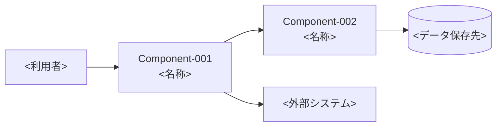

# コンポーネント設計書

<!--
本ファイルはコンポーネント設計書（docs/b1_design/component-design.md）のテンプレートである。
<> で囲まれた箇所を置き換える。記載ルールは CLAUDE.md および .claude/skills/b1-design/SKILL.md に従う。
- すべての記載に「由来」（Feature-XXX、Quality-XXX、Constraint-XXX、b1/Question-XXX 等）を記載する。由来のない記載はしない。
- 図は Mermaid で記載する。
-->

| 項目 | 内容 |
|---|---|
| 工程 | b1 コンポーネント設計 |
| plan ファイル | `plans/b1_design.md` |
| 入力 | `docs/a1_requirements/requirements.md` |
| 最終更新 | YYYY-MM-DD HH:MM |

## 1. 概要

### 背景

<要件定義書の背景・目的の要約>（由来：<requirements.md 1. 概要>）

### 対象範囲

<本設計が対象とする要件の範囲>（由来：<Feature-XXX 等>）

## 2. 目標と非目標

### 目標

| 目標 | 由来 |
|---|---|
| <設計で達成すること> | <Feature-XXX、Quality-XXX> |

### 非目標

| 非目標 | 根拠 | 由来 |
|---|---|---|
| <設計で達成しないこと> | <根拠> | <requirements.md 3. 対象範囲（対象外）、b1/Question-XXX> |

## 3. 全体構成

<!-- 利用者、コンポーネント、外部システムの関係を Mermaid で記載する。 -->

| 項目 | 内容 | 由来 |
|---|---|---|
| 実行環境 | <Web、モバイル等> | <Constraint-XXX、Decision-XXXX> |
| 配置先 | <ホスティング等> | <Decision-XXXX> |

## 4. コンポーネント

<!--
記載例：
### Component-001：<名称>

- 責務：<何を担うか>
- インターフェース：<提供する操作・API>
- 依存関係：<Component-XXX、外部システム>
- 対応する要件：<Feature-XXX、Quality-XXX>
- 関連する設計判断：<Decision-XXXX>
-->

## 5. データ設計

| データ名 | 保存先 | 形式 | 保存期間 | 機密性への対策 | 由来 |
|---|---|---|---|---|---|
| <requirements.md 6. 主要なデータのデータ名> | <保存先> | <形式> | <期間> | <暗号化、アクセス制御等> | <requirements.md 6.、Decision-XXXX> |

## 6. 外部インターフェース

| 連携先 | 連携方式 | 認証 | 扱うデータ | 由来 |
|---|---|---|---|---|
| <外部システム> | <API、ファイル等> | <方式> | <データ> | <Feature-XXX、Decision-XXXX> |

## 7. 横断的な関心事

### セキュリティ（脅威分析：STRIDE）

| 分類 | 対象 | 脅威 | 対策 | 対応する要件 |
|---|---|---|---|---|
| なりすまし（Spoofing） | <Component-XXX 等> | <脅威> | <対策> | <Quality-XXX> |
| 改ざん（Tampering） | | | | |
| 否認（Repudiation） | | | | |
| 情報漏えい（Information Disclosure） | | | | |
| サービス妨害（Denial of Service） | | | | |
| 権限昇格（Elevation of Privilege） | | | | |

### 認証・認可

<方式と対象>（由来：<Quality-XXX、Decision-XXXX>）

### プライバシー

<個人情報の扱い>（由来：<requirements.md 6. 主要なデータ、Quality-XXX>）

### ログ・監視

<記録する事項、監視する事項>（由来：<Quality-XXX>）

### エラー処理

<エラー発生時の扱い>（由来：<Quality-XXX、b1/Question-XXX>）

### テストのしやすさ

<!-- 実行環境固有の機能に依存する部分をロジックから分離し、Small テストで代用品（モック）に置き換えられる構成とする。 -->

| 実行環境固有の機能 | 依存する Component | 分離の方法 | ローカルで確認できない範囲と、確認するテストのサイズ | 由来 |
|---|---|---|---|---|
| <例：GAS の SpreadsheetApp> | <Component-XXX> | <例：データアクセス部分を分離し、ロジックは引数で受け取る> | <例：実際のシートの読み書き → Medium> | <Decision-XXXX、b1/Question-XXX> |

## 8. 画面設計

<!-- 画面がない場合は「画面なし」と記載し、由来を記載する。モックは mockups/ 配下の HTML をブラウザで開いて確認する。 -->

### 見た目の基準

<デザインシステム、アクセシビリティの基準等>（由来：<b1/Question-XXX>）

### 画面一覧

| Screen | 名称 | 利用者 | 対応する Feature | 担当する Component | モック | 由来 |
|---|---|---|---|---|---|---|
| Screen-001 | <名称> | <利用者> | <Feature-XXX> | <Component-XXX> | [Screen-001.html](mockups/Screen-001.html) | <b1/Question-XXX（採用案）> |

### 画面遷移

### 画面ごとの項目

<!--
記載例：
#### Screen-001：<名称>

| 項目 | 種別 | 内容 | 由来 |
|---|---|---|---|
| <項目名> | <表示／入力／操作> | <内容・入力の制約> | <Feature-XXX、requirements.md 6. 主要なデータ> |
-->

## 9. 検討した代替案

<!-- 設計判断の詳細は decisions/ 配下の記録を参照する。 -->

| 設計判断 | 題名 | 採用した選択肢 | 検討した他の選択肢 |
|---|---|---|---|
| [Decision-0001](decisions/Decision-0001-<題名>.md) | <題名> | <採用> | <不採用の選択肢> |

## 10. トレーサビリティ

<!-- すべての Feature・Quality・Constraint が、いずれかの Component・Screen・設計事項に対応していること。 -->

| 要件 | 対応する Component・Screen・設計事項 | 備考 |
|---|---|---|
| Feature-001 | <Component-XXX、Screen-XXX> | |
| Quality-001 | <Component-XXX、7. 横断的な関心事> | |
| Constraint-001 | <Decision-XXXX 等> | |

## 11. 変更履歴

| 日時 | スキル | 変更内容 | 根拠 |
|---|---|---|---|
