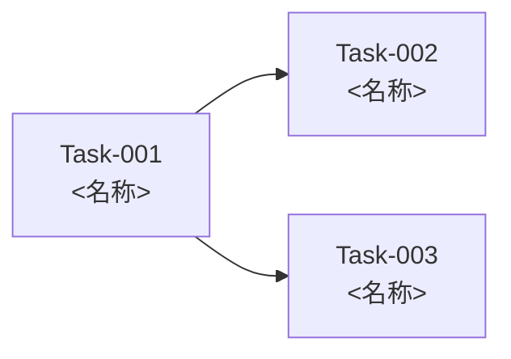

# 実装計画書

<!--
本ファイルは実装計画書（docs/c1_implementation-plan/implementation-plan.md）のテンプレートである。
<> で囲まれた箇所を置き換える。記載ルールは CLAUDE.md および .claude/skills/c1-implementation-plan/SKILL.md に従う。
- すべての記載に「由来」（Component-XXX、Decision-XXXX、Feature-XXX、c1/Question-XXX 等）を記載する。由来のない記載はしない。
- 図は Mermaid で記載する。
-->

| 項目 | 内容 |
|---|---|
| 工程 | c1 実装計画 |
| plan ファイル | `plans/c1_implementation-plan.md` |
| 入力 | `docs/b1_design/component-design.md`、`docs/b1_design/decisions/` |
| 最終更新 | YYYY-MM-DD HH:MM |

## 1. 概要

### 対象範囲

| 対象 | 由来 |
|---|---|
| <Component-XXX> | <component-design.md 4. コンポーネント> |

### 対象外

| 対象外 | 根拠 | 由来 |
|---|---|---|
| <Component-XXX 等> | <根拠> | <c1/Question-XXX> |

## 2. 開発の前提

| 項目 | 内容 | 由来 |
|---|---|---|
| ディレクトリ構成 | <下記参照> | <Decision-XXXX、c1/Question-XXX> |
| コーディング規約・フォーマッタ | <規約名・ツール名> | <c1/Question-XXX> |
| 静的解析ツール | <ツール名・設定> | <c1/Question-XXX> |
| 脆弱性チェックツール | <ツール名> | <c1/Question-XXX> |
| 脆弱性の許容する基準 | <不合格とする深刻度（例：High 以上）> | <c1/Question-XXX> |
| テストの実行環境とツール | <テストツール、代用品（モック）の作り方、ローカルで実行できない範囲> | <component-design.md 7.（テストのしやすさ）、c1/Question-XXX> |
| デプロイの方法 | <例：clasp を用いたスクリプト（npm run deploy）、IaC のツール名> | <Decision-XXXX、c1/Question-XXX> |
| ブランチ運用 | <運用方法> | <c1/Question-XXX> |
| 依存ライブラリの管理方法 | <ツール名・方針> | <Decision-XXXX、c1/Question-XXX> |

### ディレクトリ構成

```
<ディレクトリ構成>
```

## 3. タスク一覧

| Task | 名称 | Component | 対応する要件 | 依存するタスク |
|---|---|---|---|---|
| Task-001 | <名称> | <Component-XXX> | <Feature-XXX、Quality-XXX> | <なし／Task-XXX> |

## 4. タスクの詳細

<!--
記載例：
### Task-001：<名称>

- Component：<Component-XXX>（責務：<責務>）
- 対応する要件：<Feature-XXX、Quality-XXX>
- 依存するタスク：<Task-XXX／なし>
- 作業内容：<何を実装するか>
- 作成・更新する予定のファイル：<src/...、tests/...>
- 完了条件：
  - ビルドが成功する
  - 静的解析ツールの指摘が 0 件
  - 脆弱性チェックで許容する基準を超える脆弱性が 0 件
  - 下記のテスト期待値を確認する Small テストがすべて成功する
  - docs/c2_implement/implementation-design.md が更新されている
  - <タスク固有の条件（根拠資料にある場合）>（由来：<ID>）
- テスト期待値の概要：

  | # | 条件 | 期待される結果 | 由来 |
  |---|---|---|---|
  | 1 | <条件> | <期待される結果> | <Feature-XXX の受け入れ条件 N、Component-XXX のインターフェース、c1/Question-XXX> |
  | 2 | <異常時の条件> | <期待される結果> | <由来> |
-->

## 5. 実装の順序

<!-- 依存関係に従う。依存関係のないタスク同士は、開発者の指定があればそれに従い、なければ Task 番号順とする。 -->



| 順序 | Task | 順序の根拠 |
|---|---|---|
| 1 | Task-001 | <依存関係なし、番号順> |

## 6. トレーサビリティ

<!-- すべての Component が、いずれかのタスクに対応していること。 -->

| Component | 対応するタスク | 備考 |
|---|---|---|
| Component-001 | <Task-XXX> | |

## 7. 変更履歴

| 日時 | スキル | 変更内容 | 根拠 |
|---|---|---|---|
