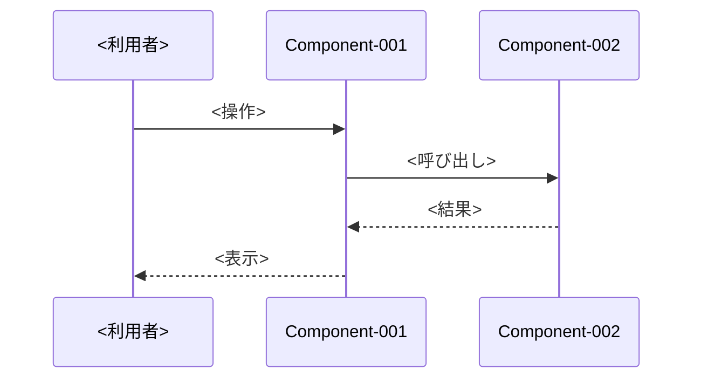

# 実装設計書

<!--
本ファイルは実装設計書（docs/c2_implement/implementation-design.md）のテンプレートである。
実装後の実際の構成（どのファイルに何があるか）を記載する。
<> で囲まれた箇所を置き換える。記載ルールは CLAUDE.md および .claude/skills/c2-implement/SKILL.md に従う。
- c2 はタスクを完了するたびに本書を更新する。更新するまでタスクを完了としない。
- c4・d1 は本書とコードが一致していることを確認する。
- src/・tests/ を読む前に本書を読み、必要なファイルのみを読む。
-->

| 項目 | 内容 |
|---|---|
| 工程 | c2 実装 |
| plan ファイル | `plans/c2_implement.md` |
| 入力 | `docs/c1_implementation-plan/implementation-plan.md` |
| 最終更新 | YYYY-MM-DD HH:MM |

## 1. ディレクトリ構成

```
<ディレクトリ構成（ツリー）>
```

| フォルダ | 役割 | 由来 |
|---|---|---|
| `<パス>/` | <役割> | <implementation-plan.md 2. 開発の前提> |

## 2. ファイル一覧

| パス | 役割 | Component | Task |
|---|---|---|---|
| `src/<パス>` | <役割> | <Component-XXX> | <Task-XXX> |

## 3. テストファイル一覧

| パス | 確かめる対象 | Task と期待値 |
|---|---|---|
| `tests/<パス>` | <対象のファイル・機能> | <Task-XXX 期待値1〜N> |

## 4. 主要な処理の流れ

<!-- Component をまたぐ処理のみを Mermaid で記載する。 -->



## 5. 計画との違い

<!-- 実装計画の「作成・更新する予定のファイル」と、実際に作成・更新したファイルの違い。 -->

| Task | 計画 | 実際 | 根拠 |
|---|---|---|---|
| <Task-XXX> | <予定のファイル> | <実際のファイル> | <c2/Question-XXX、c1/Question-XXX 等> |

## 6. 変更履歴

| 日時 | スキル | 変更内容 | 根拠 |
|---|---|---|---|
